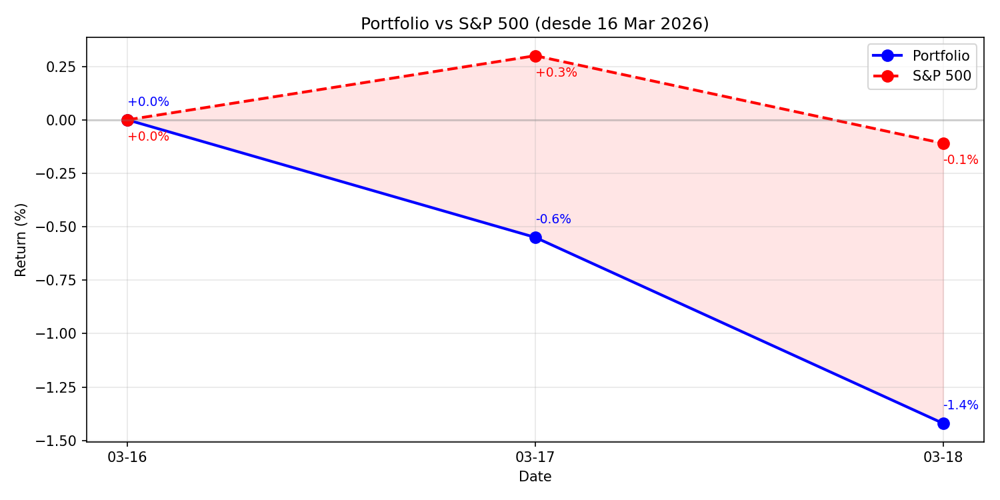

# Daily Report — Miércoles 18 Marzo 2026

## 1. Portfolio vs S&P 500

| Fecha | Portfolio | S&P 500 | Alpha |
|-------|----------|---------|-------|
| 16 Mar (inicio) | 0.0% | 0.0% | — |
| 17 Mar | -0.6% | +0.3% | -0.9pp |
| 18 Mar | -1.4% | -0.1% | -1.3pp |

## 2. Resumen del día
Portfolio Health day + FOMC. Resultado FOMC: NEUTRAL-HAWKISH, plan Mar 26 sin cambios. 15 R1 + 11 DA con agentes formales. Sector views 32/33 fresh. Sistema de objetivos pactados y tracker vs S&P creados.

## 3. Portfolio Demo
| Ticker | Invertido | P&L | P&L% |
|--------|----------|-----|------|
| HLNE | $1,264 | +$47.2 | +3.7% |
| CVNA (S) | $93 | +$3.1 | +3.3% |
| DOCS | $991 | +$15.0 | +1.5% |
| IHP.L | $1,390 | +$3.2 | +0.2% |
| FTNT | $862 | -$10.3 | -1.2% |
| NVO | $1,476 | -$19.1 | -1.3% |
| TW | $697 | -$12.2 | -1.8% |
| EDEN.PA | $2,218 | -$55.7 | -2.5% |
| WKL | $905 | -$28.0 | -3.1% |
| MONY.L | $888 | -$46.0 | -5.2% |
| ADBE | $1,014 | -$62.1 | -6.1% |
| **TOTAL** | **$11,798** | **-$164.8** | **-1.4%** |

Cash: EUR 424 (4.1%)

## 4. Operaciones ejecutadas
Ninguna operación hoy.

## 5. Decisiones tomadas
- FOMC scoring: NEUTRAL-HAWKISH → plan Mar 26 sin cambios
- NVO trim mantener 14.3 shares (reconfirmado)
- SPGI: si toca $420 antes del 26, comprar con cash existente (EUR 424)
- Sistema de objetivos pactados creado (agreed_objectives.md)
- Cash target, basket targets, timing: PENDING primera charla estratégica mañana

## 6. Trabajo del especialista
| Tipo | Cantidad | Detalle |
|------|----------|---------|
| R1 thesis.md | 15 | IHG, APPF, PCTY, IBKR, LPLA, CSGP, IDXX, MSI, ORLY, CDW, SSNC, MTD, ENTG, CTAS, ROL |
| R2 devils_advocate.md | 11 | ERIE, PEGA, LOPE, MONC.MI, ECL, MORN, CSGP, ORLY, SHW, LPLA, IHG |
| R3 resolutions | 0 | — |
| R4 committee | 0 | — |
| Sector views refreshed | 18 | 32/33 total fresh |
| Smart money reports | 1 | daily_2026-03-17.md |
| KC sweeps | 2 | morning + afternoon |
| Stress test | 1 | 2026-03-18.json |

## 7. Pipeline status
| Stage | Cantidad |
|-------|----------|
| Con thesis.md | 139 |
| Con DA | ~45 |
| R3 complete | 4 (MCO, CBOE, SPG, AAPL) |
| R4 approved | 6 (GDDY, DNLM.L, SPGI, ALFA.L, HALO paused, MONC.MI conditional) |
| Near entry (<5%) | 2: SPGI 1.7%, KNSL 2.1% |

## 8. Baskets
| Basket | Posiciones | %Portfolio | Health |
|--------|-----------|-----------|--------|
| US Quality | 3 (ADBE, HLNE, DOCS) | 26.5% | HEALTHY — GDDY entrando Mar 26 |
| UK Quality | 2 (IHP.L, MONY.L) | 18.9% | OK — MONY.L sale, DNLM.L entra |
| D&A Monopolies | 2 (TW, WKL) | 13.3% | OK — SPGI entrando Abril |
| EU Pricing Power | 1 (EDEN.PA) | 18.1% | DEATH_WATCH ~Apr 6 |
| Cybersecurity | 1 (FTNT) | 7.4% | CRITICAL — 0 post exit Abril |
| NVO (orphan) | 1 | 11.7% | Trimming Mar 26 |

## 9. Objetivos — cumplimiento
| Objetivo | Meta | Resultado | |
|----------|------|-----------|---|
| Screening (R1) | ≥5/día | 15 hoy | ✅ |
| DA (R2) | ≥5/día | 11 hoy | ✅ |
| Smart money | ≥1/día | 0 hoy | ❌ |
| R4 | ≥5/semana | 2 esta semana | ❌ |
| Pipeline velocity | ≥15/semana | 12 esta semana | ❌ |
| Sector views | 0 stale | 3 stale | ❌ |
| KC review | diaria | 2 sweeps | ✅ |
| Stress test | ≥1/semana | 2 esta semana | ✅ |
| Tweets | 5/día | 0 X, 6 eToro | ❌ |
| FV consistency | 0 divergencias | 0 | ✅ |
| System integration | 0 gaps | 0 | ✅ |
| File hygiene | <50 líneas | OK | ✅ |

Total: 9/16 (56%)

## 10. Eventos y contexto
- **FOMC**: Tipos sin cambios. Dot plot 1 recorte mantenido. 7 miembros ven 0 (drift hawkish). Inflación 2.7%.
- **Iran/Hormuz**: Día 22 cerrado. Oil $95 WTI. Bajando lentamente.
- **SPGI**: 1.7% del trigger $420. Si mercado cae post-FOMC, podría triggerearse.
- **ADBE**: peor P&L (-6.1%). Growth multiple compression por FOMC hawkish.

## 11. Twitter @nopaixx
- Tweets X: 0 (Chrome no disponible)
- Posts eToro: 6 (via API)
- Followers: ~6
- Pendiente: engagement session cuando Chrome disponible

## 12. Errores y autocrítica
| Quién | Error | Corrección |
|-------|-------|-----------|
| Gobernator | Screening 0 en script (pero specialist hizo 15 R1) | Fix detection en objectives_check.py |
| Gobernator | Smart money 0 hoy | Priorizar mañana |
| Gobernator | Tweets X 0 | Necesita Chrome abierto |

## 13. Pendiente y plan mañana
### Urgente
- SPGI watch: 1.7% del trigger. Monitorizar.

### Mañana (jueves — Smart Money + Discovery day)
- 09:00: **PRIMERA charla estratégica** — pactar cash target, basket targets, timing
- smart_money.py discover + sector-overlay
- insider_tracker.py posiciones + pipeline
- 5 R1 + 5 DA con agentes
- eToro posts via API

### Próximos eventos
- Mar 26: 4 trades (GDDY, DNLM.L, NVO trim, MONY.L sell) — 8 días
- Abril: FTNT exit → capital para SPGI/ALFA.L/MONC.MI
- Mayo: DOCS Q4, HLNE Q4, NVO Q1 (binarios)
- Jun 2: HALO PTAB
