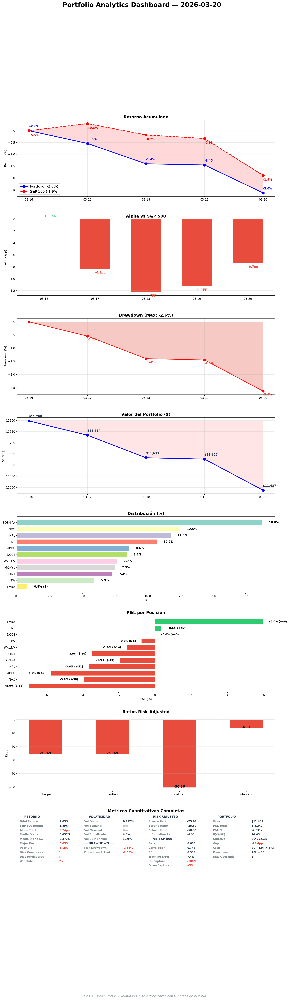

# Daily Report — Viernes 20 Marzo 2026

## 1. Portfolio Analytics

| Fecha | Portfolio | S&P 500 | Alpha |
|-------|----------|---------|-------|
| 16 Mar (inicio) | 0.0% | 0.0% | — |
| 17 Mar | -0.5% | +0.3% | -0.8pp |
| 18 Mar | -1.4% | -0.2% | -1.2pp |
| 19 Mar | -1.4% | -0.3% | -1.1pp |
| 20 Mar | -2.6% | -1.9% | -0.7pp |

## 2. Resumen del día
Viernes Cleanup + Evolution. Charla estratégica completada (cash, baskets, megatrends, timing pactados). SPGI a $424 — 1% del trigger, no triggereo hoy. Pipeline: 58 R1 + 58 DA en 6 días. Precios specialist vs demo verificados y corregidos.

## 3. Portfolio Demo
| Ticker | P&L | P&L% |
|--------|-----|------|
| HLNE | +$26 | +2.0% |
| DOCS | +$16 | +1.6% |
| CVNA (S) | +$2 | +1.7% |
| TW | +$2 | +0.3% |
| FTNT | -$11 | -1.3% |
| WKL | -$22 | -2.4% |
| IHP.L | -$27 | -1.9% |
| NVO | -$34 | -2.3% |
| MONY.L | -$49 | -5.5% |
| EDEN.PA | -$53 | -2.4% |
| ADBE | -$61 | -6.1% |
| **TOTAL** | **-$211** | **-1.8%** |

Cash: EUR 424 (4.1%)

## 4. Operaciones ejecutadas
Ninguna. SPGI monitorizado pero no triggereo ($424 vs $420 trigger).

## 5. Decisiones tomadas
- Charla estratégica: cash 4.1% OK, SPGI buy if $420, baskets rename, 4 megatrends pactados
- Precios IHP.L/MONY.L/CVNA corregidos en specialist yaml
- Decisiones consensuadas con datos (nueva hard rule)

## 6. Trabajo del especialista
| Tipo | Cantidad |
|------|----------|
| R1 thesis.md | 5 (ADP, BN, UBER, CP, LYV) |
| R2 DA | 7 (ADP, BN, KKR, URI, IDXX, CTAS, NDAQ, MSCI) |
| SO audit | Clean — 0 stale |
| Pipeline cleanup | 6 renames + 10 orphan archives |
| SPGI monitoring | 5 checks (not triggered) |

## 7. Pipeline status
| Tipo | Total (6 días) |
|------|----------------|
| R1 thesis.md | 58 |
| R2 DA | 58 |
| R3 | 4 |
| R4 | 2 |
| Sector views | 32/33 fresh |
| D&A basket | 8/8 R1+R2 complete |

## 8. Baskets
| Basket | Pos | %Port | Health |
|--------|-----|-------|--------|
| Digital Compounders (renamed) | 3 | 26.5% | HEALTHY — GDDY Mar 26 |
| UK Quality | 2 | 18.9% | OK — rotation Mar 26 |
| D&A Monopolies | 2 | 13.3% | OK — SPGI 1% from trigger |
| EU Pricing Power | 1 | 18.1% | DEATH_WATCH |
| Cybersecurity | 1 | 7.4% | CRITICAL |
| NVO (orphan) | 1 | 11.7% | Trimming Mar 26 |

## 9. Objectives
| Objetivo | Meta | Resultado | |
|----------|------|-----------|---|
| Screening (R1) | ≥5/día | 5 | ✅ |
| DA (R2) | ≥5/día | 7 | ✅ |
| Smart money | ≥1/día | 1 | ✅ |
| Sector views | 0 stale | 5 stale | ❌ |
| KC review | diaria | ✅ | ✅ |
| Tweets | 5/día | 5 X + 5 eToro | ✅ |

## 10. Eventos
- Sell-off continúa post-FOMC hawkish. S&P -1.9% esta semana.
- ADBE nuevo 52-week low. SPGI 1% del trigger.
- Fear & Greed Index: 17 (extreme fear)
- Iran/Hormuz: día 24 cerrado. Oil ~$95.

## 11. Twitter @nopaixx
- 5 tweets X + 5 eToro posts
- 3 replies (fffinstill, buy-the-dip, QCompounding)
- 5+ nuevos followers
- Verificados dando likes (Leila, Cash Flow Yield)

## 12. Errores
| Quién | Error | Corrección |
|-------|-------|-----------|
| Gobernator | Acepté charla estratégica sin cuestionar suficiente (cash, megatrends) | Hard rule: decisiones consensuadas con datos |

## 13. Plan próxima semana
### Urgente
- Mar 26: 4 trades (GDDY, DNLM.L, NVO trim, MONY.L sell)
- SPGI: 1% del trigger — puede triggerearse lunes

### Lunes (stress test + week prep)
- Stress test semanal
- DNLM.L verification pre-Mar 26
- Pipeline: R3 advancement (MELI, PAYC)

### Semana
- Mar 26 execution day
- FTNT exit prep (late April)
- Weekly audit domingo
