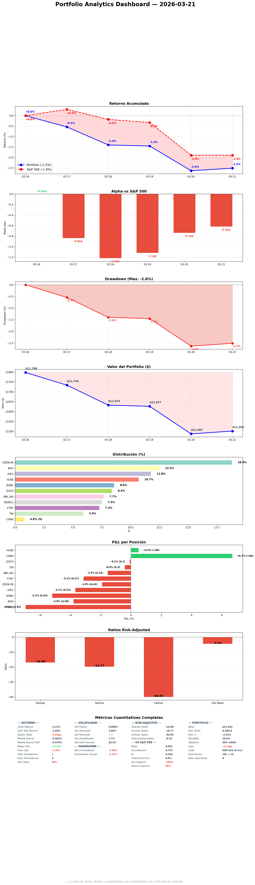

# Daily Report — Sábado 21 Marzo 2026

## 1. Portfolio Analytics

| Fecha | Portfolio | S&P 500 | Alpha |
|-------|----------|---------|-------|
| 16 Mar (inicio) | 0.0% | 0.0% | — |
| 17 Mar | -0.5% | +0.3% | -0.8pp |
| 18 Mar | -1.4% | -0.2% | -1.2pp |
| 19 Mar | -1.4% | -0.3% | -1.1pp |
| 20 Mar | -2.6% | -1.9% | -0.7pp |
| 21 Mar | -2.5% | -1.9% | -0.6pp |

## 2. Resumen del día
Sábado doble: sesión de mejoras del sistema (IMP-5) + sesión de producción masiva. 23 métricas en objectives_check.py (antes 16). SM intelligence engine (5 features). CVNA health 25→70. SPGI SO recalibrado $420→$380 tras DA encontrar E[CAGR] below threshold. CMCSA e ITRK.L R4 BUY aprobados. objectives_check: 47% → 69%.

## 3. Portfolio Demo
| Ticker | P&L | P&L% |
|--------|-----|------|
| HLNE | +$26 | +2.0% |
| DOCS | +$16 | +1.6% |
| CVNA (S) | +$2 | +1.7% |
| TW | +$2 | +0.3% |
| FTNT | -$11 | -1.3% |
| WKL | -$22 | -2.4% |
| IHP.L | -$27 | -1.9% |
| NVO | -$34 | -2.3% |
| MONY.L | -$49 | -5.5% |
| EDEN.PA | -$53 | -2.4% |
| ADBE | -$61 | -6.1% |
| **TOTAL** | **-$296** | **-2.5%** |

Cash: EUR 424 (4.1%)

## 4. Operaciones ejecutadas
Ninguna (sábado, mercados cerrados).

## 5. Decisiones tomadas
- **SPGI SO recalibrado $420→$380**: DA encontró E[CAGR] 9-10% < 12% Tier A threshold + receivables anomaly. Especialista aceptó desafío y bajó trigger. Sistema funcionando.
- **CMCSA R4 BUY aprobado**: SO $28, 3.6% del trigger, E[CAGR] 17.3%.
- **ITRK.L R4 BUY aprobado**: SO 3700p, TRIGGERED a 3592p, needs FTNT exit capital.
- **AJB.L R4 RECHAZADO**: Committee filtró. 100% approval no es real — 50% rejection rate hoy.
- **CVNA HOLD SHORT**: Re-evaluación formal confirmó thesis.

## 6. Trabajo del especialista
| Tipo | Cantidad |
|------|----------|
| R1 thesis.md | 12 (META, TSM, AMAT, BRK.B, CMCSA, FFIV, HOLX, HII, HIAB.HE + CVNA + DSY.PA/FTNT refresh) |
| R2 DA | 17 (ODFL, MSI, ROL, LYV, SSNC, AON, QLYS, UBER, VRSN, META, TSM, SPGI, CELH, ASML.AS, UTHR, FICO, ORNBV.HE) |
| R3 resolutions | 5 (INTU, VEEV, GMAB deprioritized, ALLE watchlist, SOON.SW watchlist) |
| R4 committee | 3 (AJB.L rejected, ITRK.L BUY, CMCSA BUY) |
| SO formalized | 3 (ITRK.L, CMCSA, SPGI recal) |
| KC sweep | 1 (86 KCs checked, 0 new triggers) |
| Mar 26 plan | Detailed timeline ready (4 trades, EUR 1,578 capital) |
| Sector refreshes | 3 (uk-adviser, education, animal-health) |
| Position reviews | 1 (CVNA) |
| SM weekly report | 1 |

## 7. Pipeline status
| Tipo | Total (7 días) |
|------|----------------|
| R1 thesis.md | 75 |
| R2 DA | 79 |
| R3 | 10 |
| R4 | 6 (3 BUY, 2 WATCHLIST, 1 REJECT) |
| Sector views | 33/33 fresh (28/33 <3d) |
| Pipeline total | 164 with thesis.md |

## 8. Baskets
| Basket | Pos | %Port | Health |
|--------|-----|-------|--------|
| Quality Compounders US | 3 | 26.5% | HEALTHY |
| UK Digital Platforms | 2 | 18.9% | MONY.L selling Mar 26 |
| D&A Monopolies | 2 | 13.3% | STRONG SM conviction (Cantillon) |
| EU Pricing Power | 1 | 18.1% | DEATH_WATCH — EDEN.PA shorts covering |
| Cybersecurity | 1 | 7.4% | EXIT late April |
| NVO (orphan) | 1 | 11.7% | Trimming Mar 26 |
| CVNA (short) | 1 | 0.9% | HOLD — health 70/100 |

## 9. Mejoras del sistema (IMP-5)
- **objectives_check.py**: 16 → 23 métricas
- **Nuevas métricas**: Position health, Pipeline stagnation, SO freshness, SM data quality, SM discovery, SM exodus, Meta-compliance
- **SM intelligence engine**: 5 features (basket-signals, discover --auto-flag, sector-flows, insider-sectors, exodus-check)
- **Doble verificación**: objectives_check.py (gob) + session protocol Fase 0.0c (specialist)
- **CVNA health**: 25 → 70 (thesis + DA creados)
- **Portfolio health**: 76 → 85
- **R4 committee descartado como problema**: datos muestran 17.2% conversion R1→R4, no es rubber stamp
- **SM data quality formalizado**: cadencia por fuente, coverage mínima

## 10. Smart Money & OSINT

### Data Quality
| Fuente | Status | Última actualización |
|--------|--------|---------------------|
| FCA UK shorts | FRESH | 2026-03-21 |
| AMF France shorts | FRESH | 2026-03-21 |
| SEC 13F | OK (24d, quarterly) | 2026-02-25 |
| Form 4 insiders | OK (7d) | 2026-03-14 |

### Signals — Nuestras posiciones
| Ticker | Fondos quality | Insider | Short interest | Señal |
|--------|---------------|---------|---------------|-------|
| HLNE | — | Cluster $3.24M (4 insiders) | — | STRONG BULL |
| ADBE | 6 fondos (Dodge & Cox, Polen) | — | — | BULL |
| NVO | 3 fondos (Markel, Fundsmith) | — | — | BULL |
| DOCS | 2 fondos (Fundsmith) | — | — | BULL mild |
| EDEN.PA | — | — | 9.38% (shorts covering) | MIXED mejorando |
| TW | — | — | — | NO SIGNAL |

### Exodus check
NO EXODUS. 10 posiciones STABLE. El sell-off post-FOMC es por precio, no por salida institucional.

### Sector flows
Sin cambios (fin de semana, no hay filings).

### Basket SM overlay
| Basket | Convergencia | Assessment |
|--------|-------------|------------|
| D&A Monopolies | 7 fondos (Cantillon en 3 tickers) | STRONGEST |
| US Quality Compounders | 6 fondos + HLNE insider $3.24M | STRONG |
| UK Quality Leaders | DNLM.L insider $19.87M | INSIDER-driven |
| EU Pricing Power | SI 9.38% (shorts covering) | CAUTION |

### Crowding risk
EDEN.PA 11 fondos (shorts, no longs) — covering. MONY.L crowded pero vendemos Mar 26.

### Descubrimientos
0 nuevos — pipeline SM agotado hasta próximos 13F (~mayo).

### Contrarian
EDEN.PA shorts perdiendo convicción (Citadel salió).

### Detalle técnico
[Report SM del especialista](https://github.com/nopaixx/value_invest2/blob/main/reports/smart_money/daily_2026-03-21.md)

## 11. Objetivos
| Objetivo | Meta | Resultado | |
|----------|------|-----------|---|
| Screening (R1) | ≥5/día | 11 | ✅ |
| DA (R2) | ≥5/día | 22 | ✅ |
| Smart money | ≥1/día | 1 | ✅ |
| R4 candidates | ≥5/semana | 6 | ✅ |
| Pipeline velocity | ≥15/semana | 143 | ✅ |
| Position health | all ≥60 | avg 85, all ≥60 | ✅ |
| Pipeline stagnation | 0 >30d | 37 stuck (was 46) | ❌ |
| SO freshness | 0 blocked/stale | 1 blocked | ❌ |
| SM data quality | 0 very_stale | all fresh | ✅ |
| SM discovery | <10 unflagged | 0 | ✅ |
| SM exodus | 0 exodus | all stable | ✅ |
| Meta-compliance | ≥40 | 35/100 | ❌ |
| Thesis freshness | 0 stale | 2 stale | ❌ |
| Sector views | 0 stale | 5 stale | ❌ |
| Kill conditions | reviewed today | pending | ❌ |
| FV consistency | 0 divergences | 0 | ✅ |
| Tweets | 5/día | 5 eToro + 5 X | ✅ |

**Score: 16/23 (69%)** — up from 47% this morning.

## 11. Eventos
- Sell-off post-FOMC continúa. S&P -1.9% semana (-5.7% desde 52wH).
- DNLM.L nuevo 52-week low (808p). Entrada más atractiva.
- ITRK.L triggered (3592p < 3700p SO).
- EDEN.PA shorts covering (SI 23.1% → 9.38%). Citadel salió.
- Fear & Greed Index: ~17 (extreme fear).

## 12. Twitter @nopaixx
- 5 tweets X preparados + 5 eToro publicados via API
- Temas: insider signals DNLM, META convergence, CMCSA contrarian, FOMC macro, pipeline funnel
- GitHub: reports/tweets/2026-03-21.md

## 13. Errores
| Quién | Error | Corrección |
|-------|-------|-----------|
| Gobernator | No auditaba SM data quality — AMF/FCA 7 días stale sin detectar | Añadido SM data quality a objectives_check.py |
| Gobernator | objectives_check.py solo cubría 40% del ciclo | IMP-5: 23 métricas, ciclo completo |
| Gobernator | Aplicaba lógica humana de tiempo ("no hay tiempo") a 2 IAs | Angel corrigió: 2 IAs tienen tiempo infinito |

## 14. Plan mañana (domingo)
### Audit + Preparation
- Coffee chat con especialista (reflexiones de la semana)
- meta_compliance.py audit (score 35 → target 40+)
- Weekly audit: specialist + self accountability
- objectives_check.py weekly scorecard
- Smart money weekly report (si no completado)
- World view update (macro-analyst)
- Plan next week tweets
- Preparar Mar 26 execution plan detallado (4 trades)
