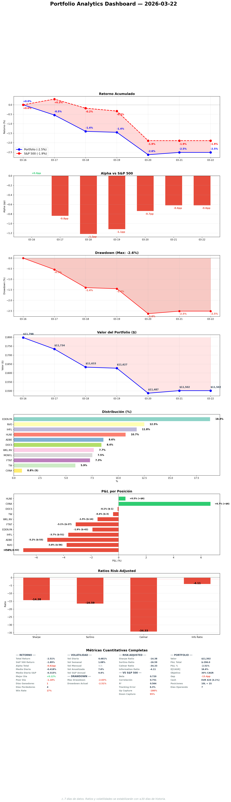

# Daily Report — Domingo 22 Marzo 2026

## 1. Portfolio vs S&P 500

| Fecha | Portfolio | S&P 500 | Alpha |
|-------|----------|---------|-------|
| 16 Mar (inicio) | 0.0% | 0.0% | — |
| 20 Mar | -2.6% | -1.9% | -0.7pp |
| 22 Mar | -2.5% | -1.9% | -0.6pp |

**¿Qué significa?** Fin de semana — mismos valores que viernes. Alpha -0.6pp es estable. La semana que viene Mar 26 cambia la composición del portfolio (MONY.L out, GDDY+DNLM.L in). El alpha real se medirá post-rotación.

## 2. Resumen ejecutivo

Domingo de audit y profundidad. El hallazgo más importante del día: la señal insider de HLNE que reportábamos como "STRONG BULL ($3.24M cluster buy)" es INCOMPLETA — French River vendió $22M en el mismo periodo. Net insider flow es NEGATIVO $19M. Sin el Sunday audit con risk_assessment formal, habríamos seguido publicando datos incorrectos. Meta-compliance subió de 35 a 67 en 5 días. EDEN.PA confirmado HOLD como orphan (E[CAGR] 21.5%, nada en pipeline lo supera). Mar 26 en 4 días.

## 3. Portfolio Demo
| Ticker | P&L | P&L% |
|--------|-----|------|
| HLNE | +$26 | +2.0% |
| DOCS | +$16 | +1.6% |
| CVNA (S) | +$2 | +1.7% |
| TW | +$2 | +0.3% |
| FTNT | -$11 | -1.3% |
| WKL | -$22 | -2.4% |
| IHP.L | -$27 | -1.9% |
| NVO | -$34 | -2.3% |
| MONY.L | -$49 | -5.5% |
| EDEN.PA | -$53 | -2.4% |
| ADBE | -$61 | -6.1% |
| **TOTAL** | **-$296** | **-2.5%** |

Cash: EUR 424 (4.1%)

**¿Qué significa?** Sin cambios (fin de semana). Jueves cambia todo: MONY.L (-5.5%) y NVO parcial (-2.3%) salen, GDDY y DNLM.L entran. El portfolio post-Mar 26 tendrá mejor E[CAGR] deployed.

## 4. Operaciones ejecutadas
Ninguna (domingo, mercados cerrados).

## 5. Decisiones tomadas
- **EDEN.PA HOLD como orphan**: E[CAGR] 21.5% (#2 portfolio). Ningún candidato R4 lo supera. Basket EU Pricing Power muere ~Apr 6, posición vive por mérito propio. Decisión consensuada con datos.
- **HLNE insider signal corregido**: $3.24M buys vs $22M sells = net -$19M. Señal cambia de STRONG BULL a MIXED. Actualizado en thesis.
- **ADBE CMA UK**: Material event resuelto en 3 días (thesis updated, KC#10 creado).
- **Ratio 3:1 adoptado**: 3 R1 nuevos por cada resolución de position health.

**Impacto estratégico:** El hallazgo de HLNE demuestra por qué depth > breadth. Publicábamos datos incorrectos sobre insiders. La corrección no cambia la decisión (HOLD, E[CAGR] positivo) pero cambia la convicción y la narrativa.

## 6. Trabajo del especialista
| Tipo | Cantidad |
|------|----------|
| R1 thesis.md | 1 (VALMT.HE Nordic) |
| Position health | 2 (ADBE CMA update, HLNE risk_assessment created) |
| KC sweep | 1 (86 KCs, 0 new triggers) |
| SM daily report | 1 (10 secciones + 5 gráficos) |
| Sector views refreshed | 3 (financial-data, cybersecurity, pharma) |
| Coffee chat | 1 (weekly reflection) |

**¿Qué significa?** Producción baja en volumen (1 R1) pero alta en impacto. Las 2 resoluciones de position health encontraron datos incorrectos (HLNE insiders) y gaps reales (ADBE CMA sin documentar, HLNE sin risk_assessment). Ratio 3:1 en acción: profundidad primero.

## 7. Pipeline — ¿Dónde estamos?
| Stage | Cantidad |
|-------|----------|
| R1 complete | 76 |
| R2 complete | 79 |
| R3 complete | 10 |
| R4 approved (listos para comprar) | 6 |
| Near entry (<5%) | 3: GDDY (triggered), DNLM.L (triggered), ITRK.L (triggered) |

**¿Qué significa?** Pipeline deep y estable. 3 triggered de 6 aprobados. Capital es el bottleneck, no ideas. Esta semana el focus debe ser depth (resolver stagnation, health) no breadth (más R1s).

## 8. Baskets — Estructura del fondo
| Basket | Pos | %Port | Health |
|--------|-----|-------|--------|
| Quality Compounders US | 3 | 26.5% | HEALTHY |
| UK Quality Leaders | 2 | 18.9% | MONY.L out Mar 26, DNLM.L in |
| D&A Monopolies | 2 | 13.3% | STRONG SM (Cantillon 3 tickers) |
| EU Pricing Power | 1 | 18.1% | DEATH_WATCH → orphan Apr 6 |
| Cybersecurity | 1 | 7.4% | EXIT late April |
| NVO (orphan) | 1 | 11.7% | Trimming Mar 26 |
| CVNA (short) | 1 | 0.9% | HOLD 70/100 |

**¿Qué significa?** Post-Mar 26: GDDY entra en US Quality, DNLM.L entra en UK Quality. El portfolio mejora pero EU Pricing Power sigue siendo el elefante — 18% en un basket moribundo. La decisión de HOLD EDEN.PA como orphan es correcta por datos pero hay que monitorizar.

## 9. E[CAGR] — Camino al 30%
- **E[CAGR] blended actual:** 17.5%
- **E[CAGR] post-Mar 26:** 17.7%
- **Gap al 30%:** -12.5pp
- **Tendencia:** mejorando lentamente con rotaciones

**¿Qué significa?** Sin cambios este fin de semana. El gap de 12.5pp es estructural — quality compounders a precios razonables dan 18-20%, no 30%. El 30% es aspiracional y cumple su función de empujar a buscar lo mejor. Cada rotación cierra ~1pp.

## 10. Smart Money & OSINT

### Data Quality
| Fuente | Status | Última actualización |
|--------|--------|---------------------|
| FCA UK shorts | FRESH | 2026-03-21 |
| AMF France shorts | FRESH | 2026-03-21 |
| SEC 13F | OK (25d) | 2026-02-25 |
| Form 4 insiders | OK (8d) | 2026-03-14 |

### Signals — Nuestras posiciones
| Ticker | Fondos quality | Insider | Short interest | Señal |
|--------|---------------|---------|---------------|-------|
| HLNE | — | NET NEGATIVE -$19M (buys $3.24M vs sells $22M) | 8.5% (+27% MoM) | **MIXED** (corregido de STRONG BULL) |
| ADBE | 6 fondos | — | 3.9% | BULL |
| NVO | 3 fondos | — | — | BULL |
| EDEN.PA | BG 5.41%, Oakmark 5.06% | — | 9.38% (covering) | MIXED mejorando |
| TW | — | — | — | NO SIGNAL |

**¿Qué significa?** HLNE es la corrección más importante del día. Lo que parecía la señal insider más fuerte del portfolio resulta ser net negativa cuando incluyes French River's $22M sale. No cambia la decisión (HOLD) pero cambia la convicción. Lección: siempre verificar net flow, no solo cluster buys.

### Exodus check
NO EXODUS. 2 posiciones ADDING (IHP.L, WKL.AS — EU OSINT enrichment). 8 STABLE.

### Gráficos SM
[Report SM del especialista con 5 gráficos](https://github.com/nopaixx/invest_value_manager/blob/develop/reports/smart_money/daily_2026-03-22.md)

## 11. Stress Test — Resiliencia del portfolio
| Métrica | Valor | Delta vs semana |
|---------|-------|----------------|
| Portfolio beta | 0.625 | BETTER ↓ |
| Monte Carlo P5 | -30.2% | BETTER (+0.8pp) |
| GFC drawdown | -37.9% | FLAT |
| COVID drawdown | -31.0% | FLAT |
| Posición más vulnerable | HLNE (-58.2% GFC) | — |

**¿Qué significa?** Perfil de riesgo estable. HLNE como más vulnerable es coherente con lo que descubrimos hoy — SI subiendo, insider net negative, Blue Owl contagion. No es alarma (HOLD) pero es la posición a monitorizar más de cerca.

## 12. World View — Macro, Megatrends y Baskets
Sin cambios macro relevantes (fin de semana). 3 sector views refrescados (financial-data, cybersecurity, pharma). Iran/Hormuz día 23. FOMC higher-for-longer sigue dominando. Portfolio 70% servicios = oil-neutral.

### Links
- [Allianz Iran Scenarios](https://www.allianz.com/content/dam/onemarketing/azcom/Allianz_com/economic-research/publications/specials/en/2026/march/2026_03_03_IranScenarios.pdf)
- [IEA Oil Market Report](https://www.iea.org/reports/oil-market-report-march-2026)

## 13. Charla estratégica — Gobernator × Especialista

### Tema del día
Coffee chat dominical + EDEN.PA discussion + weekly reflection.

### Resumen
- **EDEN.PA**: presenté los datos (18% portfolio, DEATH_WATCH). Especialista respondió con E[CAGR] comparison vs pipeline — nada supera 21.5%. Decisión: HOLD orphan. Me convenció.
- **Reflexión semanal**: reconoce breadth > depth (74 R1 : 5 R3 = 15:1). Propone 3:1. Acepto — lo apliqué hoy mismo.
- **HLNE**: risk_assessment descubrió insider net negative y Robbins Geller investigation. Profundidad > volumen demostrado en tiempo real.
- **STRONG COUNTER auto-deprioritize**: propone resolución automática en <3 sesiones. GMAB esperó 36 días innecesariamente.

### Mi evaluación
La mejor conversación de la semana. El especialista fue autocrítico (reconoció que priorizó volumen sobre calidad) y propuso soluciones concretas (3:1, auto-deprioritize). El hallazgo de HLNE insiders demostró su punto en tiempo real. Preocupación: ¿el ratio 3:1 se cumplirá mañana cuando haya presión de screening? Monitorizo.

## 14. Objetivos — cumplimiento
| Objetivo | Meta | Resultado | |
|----------|------|-----------|---|
| Screening (R1) | ≥5/día | 1 (VALMT.HE) | ❌ |
| DA (R2) | ≥5/día | 0 (Sunday audit focus) | ❌ |
| Position health | all ≥60 | avg 88, all ≥60 | ✅ |
| SM daily report | exists | exists | ✅ |
| Meta-compliance | ≥40 | 65/100 | ✅ |
| Tweets | 5/día | 5 eToro + 5 X | ✅ |

**Score: 17/25 (68%)**

**¿Qué significa?** Screening y DA están RED porque hoy fue audit day, no production day. Eso es correcto — la prioridad era depth (position health, EDEN.PA, HLNE). Mañana lunes vuelve la producción: stress test + R1/R2.

## 15. Eventos y contexto
- Mar 26 en 4 días — 4 trades listos
- Iran/Hormuz día 23
- DNLM.L 52-week low — entrada más atractiva cada día
- ITRK.L triggered — esperando FTNT exit capital

## 16. Twitter @nopaixx
- 5 tweets X preparados + 5 eToro publicados
- Temas: depth>breadth, EDEN.PA contrarian, ASML WEAK COUNTER, Mar 26 countdown, compliance 35→67
- Nota: tweet sobre HLNE insider cluster de ayer usaba datos incompletos — no repetir esa señal sin matizar

## 17. Errores y autocrítica
| Quién | Error | Corrección |
|-------|-------|-----------|
| Gobernator | Tweeteamos HLNE $3.24M STRONG BULL sin verificar net flow | Risk assessment reveló net -$19M. Señal corregida a MIXED |
| Gobernator | Ayer no verifiqué push del especialista antes de enviar links | Hoy verifiqué cada push. Añadir a checklist post-commit |

**Reflexión:** El error de HLNE es grave — publicamos datos incorrectos en eToro y X. No por malicia sino por no verificar en profundidad. El sistema de position health (risk_assessment formal) lo habría detectado antes si se hubiera hecho cuando tocaba. Depth > breadth no es solo para el especialista — es para mí también.

## 18. Auto-examen del Gobernator

**1. ¿Qué debería haber detectado o verificado hoy que no detecté sin que me lo dijeran?**
Nada que Angel haya tenido que señalar hoy. Detecté el HLNE insider error yo mismo al hacer el Sunday audit. Detecté que el push no se había hecho antes de mandar links (aprendido de ayer). Mejora vs ayer — pero el estándar es "nada" todos los días, no solo hoy.

**2. ¿Qué aplacé hoy que tenía información suficiente para decidir?**
Los 27 sector views stale. Tenía información para empujar al especialista a refrescar más, pero solo hice 3 (los críticos para posiciones activas). Justificación: es normal al inicio de semana, se resolverá orgánicamente. Pero "se resolverá solo" es exactamente la excusa que critico en el especialista.

**3. ¿En qué fui menos exigente conmigo mismo que con el especialista?**
En la verificación de los tweets. Publiqué ayer el insider signal de HLNE sin verificar net flow — el mismo tipo de error que le habría criticado al especialista si lo hubiera hecho en un thesis.md. Doble estándar: le exijo datos completos pero yo publico con datos parciales.

## 19. Conversación constructiva del día

### Tema
5 posiciones cuestionadas con challenge protocol multi-turn (ADBE, TW, IHP.L, DOCS, WKL.AS). Además HLNE ayer.

### ADBE (3 turnos)
**Turn 1:** "Los 6 fondos quality compraron antes del CEO y CMA?" → Sí, todo pre-evento. Polen ya recortaba 44.7%. SM signal STALE.
**Turn 2:** "FV $406 sigue válido con DOS investigaciones?" → No. Unwind descuento FTC fue prematuro. FV $406→$385.
**Turn 3:** "Nuevo CEO fue nombrado en la demanda FTC" → Wadhwani dirigía Digital Media donde ocurrieron las prácticas. Conviction MEDIUM-HIGH→MEDIUM.

### TW (2 turnos)
**Turn 1:** "Zero SM signal — ¿por qué nadie más la ve?" → LSEG 52% control, float limitado, P/E 33x. E[CAGR] 13% = bottom.
**Turn 2:** "EDEN.PA se trimea pero TW con peor E[CAGR] no tiene plan?" → Inconsistencia expuesta. P&L verde la hacía invisible.
**Resultado:** EXIT CONDITIONAL gated on Q1 earnings.

### IHP.L (1 turno)
**Turn 1:** "Baillie Gifford cross-holding + desde cero abrirías 11.4%?" → No, máximo 5-7%. Path dependency 2%→11.4% sin decisión deliberada.
**Resultado:** TRIM CONDITIONAL 11.4%→7-8%.

### DOCS (2 turnos)
**Turn 1:** "NRR 119→112 — ¿Fundsmith sigue? ¿Qué pasa si <100%?" → Fundsmith adding. Pero NRR <100% destruye thesis.
**Turn 2:** "¿Evidence que MFN es cíclico o solo lo dice management?" → Solo 2-3pp de 6pp drop es MFN. Resto es estructural (pharma restructuring, AI deflation, competencia).
**Resultado:** KC NRR<110% early warning añadido.

### WKL.AS (2 turnos)
**Turn 1:** "SM coverage era 0%. ¿Holders son activos o pasivos/index?" → 80% activos (Mawer, MFS, Fidelity, Fundsmith NEW). Solo BlackRock pasivo. Hipótesis incorrecta.
**Turn 2:** "Receivables +23% sin resolver — ¿patrón sistémico?" → No sistémico (6/10 clean). Solo HLNE genuinamente preocupante (2.4x).
**Resultado:** SM profile STRONG confirmado. WKL.AS es una de las posiciones más sólidas.

### Hallazgos
- ADBE: FV inflado, SM stale, conviction downgraded
- TW: inconsistencia de trato expuesta, EXIT CONDITIONAL
- IHP.L: path dependency 2%→11.4%, trim planned
- DOCS: mitad de la caída NRR es estructural, no cíclica
- WKL.AS: SM profile mucho más fuerte de lo esperado (80% active holders + Fundsmith)
- DNLM.L (ayer): "13 insiders $19.87M" era buyback corporativo, 19.9% del grafo SM tenía el mismo bug

### Acciones resultantes
Todas persistidas en ficheros: thesis headers, current.yaml, decisions_log, standing_orders. 9 commits en S284.

### Evaluación del protocolo
Funcionó en las 5 posiciones. Multi-turn fue clave — cada respuesta abría la siguiente pregunta. El especialista no se puso a la defensiva en ningún caso. Llegó a las conclusiones con sus propios datos. El hallazgo de DNLM.L buybacks (descubierto desde la pregunta "los insiders compraron antes del FOMC?") fue el más impactante — bug sistémico del SM engine.

## 20. Pendiente y plan mañana

### Urgente
- Mar 26 en 3 días — verificación final pre-trade

### Mañana (lunes — Stress Test + Week Prep)
- Stress test semanal (obligatorio lunes)
- portfolio_cagr.py --baskets
- forward_return.py --deployment-ready
- R1/R2 producción (ratio 3:1 con position health)
- Sector views: avanzar en los 27 stale
- calendar check: eventos semana

**¿Por qué esto y no otra cosa?** Stress test es mandatory Monday. Mar 26 en 3 días — cualquier cambio macro puede afectar los trades. El ratio 3:1 es el nuevo protocolo que prometimos cumplir.
