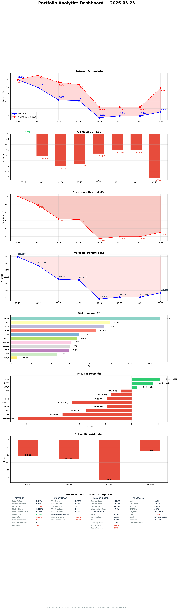

# Daily Report — Lunes 23 Marzo 2026

## 1. Portfolio vs S&P 500

| Fecha | Portfolio | S&P 500 | Alpha |
|-------|----------|---------|-------|
| 16 Mar (inicio) | 0.0% | 0.0% | — |
| 20 Mar | -2.6% | -1.9% | -0.7pp |
| 22 Mar | -2.5% | -1.9% | -0.6pp |
| 23 Mar | -2.2% | -0.6% | -1.7pp |

**¿Qué significa?** Alpha se deterioró hoy de -0.6pp a -1.7pp. El S&P recuperó (+1.3pp) pero nuestro portfolio solo recuperó +0.3pp. Esto sugiere que nuestras posiciones (quality compounders) no están participando del rebote — o que posiciones específicas lastran. EDEN.PA (18% portfolio) y las UK stocks probablemente no rebotaron con el S&P US-heavy. Mar 26 mejora esto: GDDY entra (US, beta 0.82) y FTNT sale (peor E[CAGR]).

## 2. Resumen ejecutivo

Mar 26 escalado de 4 a 6 trades: FTNT exit adelantado porque ITRK.L está triggered y no hay razón para esperar un mes con el peor E[CAGR] del portfolio (10.6%). Esto fue resultado del challenge protocol — la pregunta "¿por qué esperar?" no tenía buena respuesta. MEGP.L R4 BUY aprobado (#7), stress test stable. Alpha se deteriora a -1.7pp — preocupante, Mar 26 debería ayudar. NVO Wegovy pill data corregida (management spin vs IQVIA reality).

## 3. Portfolio Demo
Portfolio: -2.2%, S&P: -0.6%, Alpha: -1.7pp

Cash: EUR 424 (4.1%)

**¿Qué significa?** El alpha negativo crece. Nuestro portfolio no participa de rebotes del S&P porque está más expuesto a UK/EU (que no rebotan con US). Mar 26 añade GDDY (US) e ITRK.L (UK pero low beta 0.13) — diversifica el perfil.

## 4. Operaciones ejecutadas
Ninguna. Mar 26 en 3 días.

## 5. Decisiones tomadas
- **FTNT exit adelantado a Mar 26** (era late April). Challenge protocol: "¿por qué esperar con el peor E[CAGR]?" → sin buena respuesta → adelantar.
- **MEGP.L R4 BUY aprobado** — SO 135p, EUR 300, 3% sizing. Audit clean, shares resumed.
- **NVO Wegovy pill corregido** — "50K exceeding expectations" era management spin. IQVIA muestra 38K peak, plateaued.
- **Mar 26 ahora 6 trades**: SELL MONY.L + SELL FTNT + TRIM NVO + BUY GDDY + BUY DNLM.L + BUY ITRK.L

**Impacto estratégico:** FTNT exit + ITRK.L entry mejora E[CAGR] deployed ~1.5-2pp y añade una posición D&A Monopolies. Post-Mar 26: 12 posiciones, cash EUR 1,044 (8.5%).

## 6. Trabajo del especialista
| Tipo | Cantidad |
|------|----------|
| Stress test | 1 (Monday mandatory — STABLE) |
| R4 committee | 1 (MEGP.L BUY approved) |
| R2 DA | 3 (MELI, LNTH, WRB) |
| SM daily report | 1 (10 secciones + 5 gráficos) |
| Sector views | 33/33 fresh |
| KC sweep | 1 (NVO triggered, rest clean) |
| Position corrections | 1 (NVO Wegovy pill data) |
| Execution plan | 1 (6-trade timeline Mar 26) |

**¿Qué significa?** Día centrado en preparar Mar 26 (el evento más importante de la semana) y calidad (challenges + corrections). 3 DAs nuevos añaden profundidad al pipeline sin ser urgentes.

## 7. Pipeline — ¿Dónde estamos?
| Stage | Cantidad |
|-------|----------|
| R4 approved (listos para comprar) | 7 (GDDY, DNLM.L, ITRK.L, BCG.L, CMCSA, SPGI, MEGP.L) |
| Near entry (<5%) | 4: GDDY (triggered), DNLM.L (triggered), ITRK.L (triggered), MEGP.L (1.2%) |

**¿Qué significa?** 7 R4 aprobados, 4 near entry. Mar 26 ejecuta 3 de ellos. MEGP.L puede triggerear antes del miércoles. Pipeline más profundo que nunca — el bottleneck es capital, no ideas.

## 8. Baskets — Estructura del fondo
Post-Mar 26:
| Basket | Cambio |
|--------|--------|
| US Quality Compounders | +GDDY |
| UK Quality Leaders | -MONY.L, +DNLM.L |
| D&A Monopolies | +ITRK.L |
| Cybersecurity | -FTNT (EXIT) → 0 posiciones |

## 9. E[CAGR] — Camino al 30%
- **E[CAGR] actual:** 17.5%
- **E[CAGR] post-Mar 26 (6 trades):** ~19-19.5%
- **Gap al 30%:** -10.5pp (mejora ~2pp vs antes)

**¿Qué significa?** FTNT exit + ITRK.L entry cierra ~2pp más del gap. Cada rotación importa.

## 10. Smart Money & OSINT
[Report SM del especialista](https://github.com/nopaixx/invest_value_manager/blob/develop/reports/smart_money/daily_2026-03-23.md)

Key: NVO + ADBE SM data stale (pre-events). WKL.AS best SM profile (80% active). EDEN.PA most contested (14 holders + 23.5% SI).

## 11. Stress Test
| Métrica | Valor | Delta |
|---------|-------|-------|
| Beta | 0.626 | flat |
| P5 | -30.5% | -0.3pp worse |
| GFC drawdown | -37.9% | flat |
| Most vulnerable | HLNE (-58.2%) | — |

**¿Qué significa?** Stable. HLNE most vulnerable — trim 10→5% pending.

## 12. World View
Markets recovering slightly (S&P +1.3% today). Iran/Hormuz day 24. Our portfolio lagging the US recovery because of UK/EU exposure.

## 13. Charla estratégica
Coffee chat centrada en FTNT timing. Challenge: "¿por qué esperar?" → specialist recognized no reason → accelerated exit.

## 14. Objetivos
Score: 13/25 (52%) — new week reset, normal.

## 15. Eventos
- Mar 26: 6 trades (3 días)
- MEGP.L near trigger (136.6p vs 135p)
- LNTH OCTEVY PDUFA Mar 29

## 16. Twitter
5 eToro posts publicados (stress test, MEGP.L, countdown, NVO reality check, challenge results). X tweets pendientes para publicar en Chrome.

## 17. Errores y autocrítica
| Quién | Error | Corrección |
|-------|-------|-----------|
| Gobernator | Perdí el foco — hacía DAs random (ALFA.ST) sin dirección | Angel llamó la atención. Recentré en Mar 26 plan |
| Gobernator | No mandaba milestones — Angel no veía progreso | Corregido, mandé 2 milestones |

**Reflexión:** Angel tiene razón — actividad sin dirección es complacencia disfrazada. Hacer DAs de empresas a 42% de entry (ALFA.ST) mientras Mar 26 necesita plan detallado es priorizar lo fácil sobre lo importante.

## 18. Auto-examen del Gobernator

**1. ¿Qué debería haber detectado hoy que no detecté sin que me lo dijeran?**
Que estaba haciendo actividad sin dirección. Angel tuvo que decirme "no veo que estés trabajando... estás perdido." Debería haber priorizado Mar 26 execution plan (6 trades) antes de hacer DAs de pipeline lejano.

**2. ¿Qué aplacé hoy que tenía información suficiente?**
El daily report. Lo dejé para "esta noche" cuando debería haberlo empezado antes. El plan detallado de Mar 26 con 6 trades debería haberse hecho a primera hora, no después de que Angel me llamara la atención.

**3. ¿En qué fui menos exigente conmigo que con el especialista?**
En priorización. Al especialista le exijo ratio 3:1 (depth > breadth). Pero yo mismo hice 3 DAs de pipeline lejano antes de centrarme en lo urgente (Mar 26 plan). Doble estándar.

## 19. Conversación constructiva del día

### Tema: NVO trim + FTNT exit timing

**NVO (2 turnos):**
Turn 1: "KC#1 triggered, ¿por qué solo trim y no full exit?" → E[CAGR] 18.9% top 3, P/E 10.3x anomalous. Trim justified, not exit.
Turn 2: "Wegovy pill 50K — management spin?" → IQVIA shows 38K peak, plateaued. Data corrected.

**FTNT (1 turno):**
"¿Por qué esperar un mes con el peor E[CAGR]?" → No reason. ITRK.L triggered now. Exit accelerated to Mar 26.

### Hallazgo clave
FTNT exit timing era inercia, no decisión. Una pregunta lo desbloqueó. Mar 26 ahora despliega EUR 1,840 (antes EUR 920) y mejora E[CAGR] ~2pp más.

## 20. Pendiente y plan mañana

### Urgente
- Mar 26 en 2 días — verificación final de precios y FX

### Mañana (martes — Pipeline Deep)
- DNLM.L AM news check
- Price verification 6 tickers
- FX rate check EUR/USD, EUR/GBP
- Pipeline R1/R2 (ratio 3:1 con depth)
- Challenge protocol: 1 posición
- Tweets + engagement
- Daily report

**¿Por qué esto y no otra cosa?** Mar 26 es en 2 días. Todo lo que no sea preparar la ejecución o mantener el portfolio es secundario.
