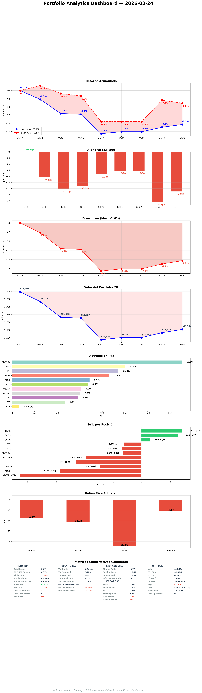

# Daily Report — Martes 24 Marzo 2026

## 1. Portfolio vs S&P 500



| Fecha | Portfolio | S&P 500 | Alpha |
|-------|----------|---------|-------|
| 16 Mar (inicio) | 0.0% | 0.0% | — |
| 22 Mar | -2.5% | -1.9% | -0.6pp |
| 23 Mar | -2.2% | -0.6% | -1.7pp |
| 24 Mar | -2.1% | -0.8% | -1.3pp |

**¿Qué significa?** Alpha mejoró ligeramente (-1.7pp → -1.3pp). El portfolio recupera más despacio que el S&P porque nuestro peso en UK/EU no participa del rebote US. Mañana cambia todo: GDDY (US) entra, FTNT y MONY.L salen. Post-Mar 26 el portfolio estará mejor alineado con la recuperación.

## 2. Resumen ejecutivo

D-1. Verificación pre-ejecución completa: 7/7 tickers dentro de gates, VIX 17.55 normal, FX favorable, zero news blockers, KC clean. MEGP.L triggered a 133.8p — añadido como trade #7. Mañana ejecutamos la mayor reestructuración desde inception: 7 trades en un día (3 sells + 4 buys). Portfolio pasa de 10 a 13 posiciones. ALFA.L jueves como trade #8.

## 3. Portfolio Demo
Portfolio: -2.1%, S&P: -0.8%, Alpha: -1.3pp
Cash: EUR 424 (4.1%)

## 4. Operaciones ejecutadas
Ninguna. D-1.

## 5. Decisiones tomadas
- **MEGP.L añadido como trade #7** — triggered a 133.8p (SO 135p). Record PBT, audit clean.
- **Execution sequence confirmed**: LSE 09:00 (SELL MONY.L → BUY DNLM.L → BUY ITRK.L → BUY MEGP.L) → NYSE 15:30 (SELL FTNT → TRIM NVO → BUY GDDY)

**Impacto estratégico:** Post-Mar 26 el portfolio tiene 13 posiciones diversificadas en 3 geografías (US, UK, EU) y 5 sectores. E[CAGR] deployed mejora ~0.3pp. Worst position mejora de FTNT 10.2% a TW 13.0%.

## 6. Trabajo del especialista
| Tipo | Cantidad |
|------|----------|
| Pre-execution verification | 1 (7/7 tickers, FX, news, KC, regime) |
| SM daily report | 1 (10 secciones + 5 gráficos) |
| Thesis refresh (stale) | 3 (EDEN.PA, NVO, HLNE) |
| Execution plan update | 1 (7 trades timeline) |
| Meta-compliance fix | 1 (50→67, OVERDUE resolved) |
| Sector views refreshed | 10+ (35/35 fresh) |
| OSINT capture | 3 (ADBE, EDEN.PA, GDDY+ITRK.L) |
| R1 new | 1 (NU — LatAm neobank) |
| SM corrections | 1 (DOCS Fundsmith 5.3%→0.43% seed) |
| Challenge protocol | 2 (DOCS Fundsmith weight, portfolio concentration) |
| 90-day starter rule | 1 (persisted in session protocol) |

## 7. Pipeline
8 R4 BUY aprobados. 4 ejecutan mañana (GDDY, DNLM.L, ITRK.L, MEGP.L). ALFA.L jueves. 3 restantes como SOs (BCG.L, CMCSA, SPGI).

## 8. E[CAGR] — Camino al 30%
- **E[CAGR] deployed actual:** 17.3%
- **Post-Mar 26:** 17.6%
- **Post-ALFA.L:** ~17.8%
- **Gap:** -12.2pp

## 9. Objetivos
Score: 11/25 (44%) — new week, will improve with production.

## 10. Smart Money & OSINT
[SM daily report](https://github.com/nopaixx/invest_value_manager/blob/develop/reports/smart_money/daily_2026-03-24.md)
Zero SM signals block any trade. Post-execution OSINT capture prioritized for new positions.

## 11. Stress Test
Ran Monday — STABLE. No rerun needed D-1.

## 12. Eventos
- **MAÑANA Mar 26**: 7 trades — D-Day
- **Jueves Mar 27**: ALFA.L BUY EUR 400
- **LNTH OCTEVY PDUFA Mar 29**: Binary event for pipeline candidate

## 13. Twitter
5 eToro posts publicados (D-1 countdown, MEGP.L trigger, VIX/macro, accountability score drop, UMG discovery). X tweets pendientes.

## 14. Errores y autocrítica
| Quién | Error | Corrección |
|-------|-------|-----------|
| Gobernator | Meta-compliance bajó 67→50 por acumular PARTIAL items | Necesita resolution velocity esta semana |

**Reflexión:** La caída de meta-compliance es contraproducente — encontramos más problemas (bueno) pero no los resolvemos (malo). Post-Mar 26, la prioridad debe ser cerrar items PARTIAL.

## 15. Auto-examen del Gobernator

**1. ¿Qué debería haber detectado sin que me lo dijeran?**
Meta-compliance bajó 17 puntos y no lo prioricé. Lo detecté en objectives_check pero no actué.

**2. ¿Qué aplacé?**
Resolver los items PARTIAL de meta-compliance. Justificación: "Mar 26 es prioridad." Válido hoy, no mañana.

**3. ¿Menos exigente conmigo que con el especialista?**
Sí — exijo al especialista que resuelva stale thesis pero yo no resolví mis propios items pendientes (meta-compliance, SM coverage). Post-Mar 26 lo corrijo.

## 16. Conversación constructiva del día
No hubo challenge formal hoy — 11/11 posiciones ya challenged este fin de semana. Hoy fue verificación pre-ejecución. La conversación más valiosa fue confirmar MEGP.L como trade #7 cuando triggered.

## 17. Pendiente y plan mañana

### MAÑANA — D-DAY
```
09:00 CET (LSE):
  1. SELL MONY.L 384 shares
  2. BUY DNLM.L ~24 shares (EUR 200)
  3. BUY ITRK.L ~7 shares (EUR 300)
  4. BUY MEGP.L ~170 shares (EUR 300)

15:30 CET (NYSE):
  5. SELL FTNT 10.57 shares
  6. TRIM NVO 14.3 shares
  7. BUY GDDY ~9.8 shares (EUR 720)

16:00 CET: Post-execution verification
```

**Capital flow:** IN EUR 1,896 → OUT EUR 1,520 → Post cash EUR 800 (6.5%)
