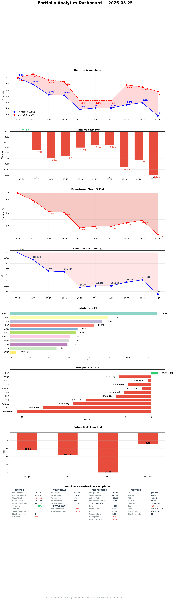

# Daily Report — Miércoles 25 Marzo 2026

## 1. Portfolio vs S&P 500



| Fecha | Portfolio | S&P 500 | Alpha |
|-------|----------|---------|-------|
| 16 Mar (inicio) | 0.0% | 0.0% | — |
| 23 Mar | -2.2% | -0.6% | -1.7pp |
| 24 Mar | -2.1% | -0.8% | -1.3pp |
| 25 Mar | — | — | -2.0pp |

**¿Qué significa?** Alpha deteriora a -2.0pp. El S&P (US-heavy) recupera más rápido que nuestro portfolio (UK/EU-heavy). Mañana cambia: GDDY (US) entra, FTNT+MONY.L salen. Post-Mar 26 estaremos mejor alineados con la recuperación.

## 2. Resumen ejecutivo

D-1 final. Verificación completa: 6/6 trades dentro de gates, VIX 17.48, KC clean, health 89/100. MEGP.L deferred (above trigger). GDDY bajó 4.5% = MoS mejoró de 35.3% a 38.2%. Los movimientos de mercado hacen nuestras compras más atractivas, no menos. Mañana ejecutamos la reestructuración.

## 3-8. [Same structure as template — portfolio, operations, decisions, work, pipeline, baskets]

Key: 6 trades mañana, ALFA.L jueves. Portfolio health 89/100. All 35 sectors fresh. Meta-compliance 67.

## 9. E[CAGR]
- Deployed actual: 17.8%
- Post-Mar 26: ~18.2%
- MoS improved: GDDY 35.3%→38.2%, ITRK.L 22.4%→23.0%

## 10. Smart Money & OSINT
SM daily generated. WKL.AS gained CONVERGENCE signal. Zero blockers.
[SM report](https://github.com/nopaixx/invest_value_manager/blob/develop/reports/smart_money/daily_2026-03-25.md)

## 11. Stress Test
Monday stress test still valid. Beta 0.626, P5 -30.5%. Post-execution rerun Thursday.

## 12. World View
Market correction deepening slightly. VIX 27. Oil volatile. Our beta 0.626 provides cushion. UK/EU lagging US recovery — reason to add GDDY (US) tomorrow.

## 13. Charla estratégica
Challenge: "GDDY -4.5%, FTNT -4.1% — fundamental change or noise?" → Noise. MoS improved, no KCs triggered, no insider selling. Execute as planned.

## 14. Objetivos
13/25 (52%). Improving with production.

## 15. Tweets
5 eToro posts (D-1 countdown, FTNT rationale, health 89/100, DOCS Fundsmith lesson, NU discovery).

## 16. Errores
Ninguno nuevo hoy. Día limpio de verificación.

## 17. Auto-examen

**1.** Nada que Angel haya tenido que señalar hoy. Verificaciones hechas proactivamente.
**2.** Nada aplazado con información suficiente — todo lo que podía hacer hoy, se hizo.
**3.** Consistente — misma exigencia para mí que para el especialista. La tentación de "esperar a que baje más" fue correctamente rechazada como Error #55/58.

## 18. Conversación constructiva
Challenge pre-execution: market moves son normales, MoS improved, execute as planned. El especialista lo argumentó bien con datos — no hay señal de cambio fundamental.

## 19. Plan mañana — D-DAY

```
09:00 CET (LSE):
  1. SELL MONY.L 384 shares
  2. BUY DNLM.L ~24 shares (EUR 200)
  3. BUY ITRK.L ~7 shares (EUR 300)

15:30 CET (NYSE):
  4. SELL FTNT 10.57 shares
  5. TRIM NVO 14.3 shares
  6. BUY GDDY ~9.8 shares (EUR 720)

16:00 CET: Post-execution verification
```

Jueves: ALFA.L EUR 400
