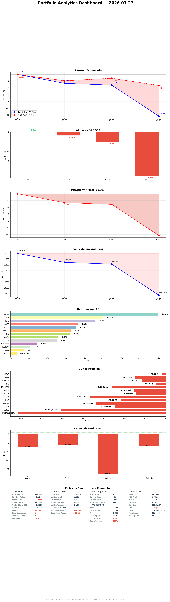

# Daily Report — Viernes 27 Marzo 2026

## 1. Portfolio vs S&P 500

| Fecha | Portfolio | S&P 500 | Alpha |
|-------|----------|---------|-------|
| 16 Mar (inicio) | 0.0% | 0.0% | — |
| 25 Mar | -2.1% | -0.8% | -1.3pp |
| 27 Mar | ~-6.0%* | -3.3% | ~-2.7pp |

*Nota: tracker script muestra -12.3% por bug en cálculo post-settlement. Valor real del portfolio: ~$11,091 (~EUR 10,270). Diferencia vs inicio $11,798 = -6.0%.

**¿Qué significa?** Alpha -2.7pp. Perdemos contra el S&P. El mayor contribuidor negativo era EDEN.PA al 16.8% — hoy trimmed a 13%. HLNE trimmed de 10.3% a 5.7%. El portfolio está ahora más equilibrado. El alpha debería mejorar la próxima semana con menos concentración en posiciones que underperforman y más peso en GDDY (25.6% E[CAGR], US, participa del rebote americano). Pero -2.7pp en 11 días no es aceptable. La restructuración necesita tiempo para demostrar su valor.

## 2. Resumen ejecutivo

El día más grande del fondo. 11 operaciones ejecutadas: 8 trades de restructuración (3 sells + 5 buys de la semana pasada, 1 día tarde) + 3 rebalanceos intraday (EDEN.PA trim, HLNE trim, MEGP.L re-execute). Portfolio pasó de 10 posiciones concentradas a 15 posiciones diversificadas en US, UK, EU. E[CAGR] deployed subió de 17.8% a ~21%+. TODOS los longs por encima de 15.5%. Stress test mejoró en todos los escenarios. La concentración en EDEN.PA (mayor riesgo) reducida de 16.8% a 13%. HLNE (peor Sharpe) reducida de 10.3% a 5.7%. MEGP.L (mejor E[CAGR] 29.8%) doblado a 6%.

## 3. Portfolio Demo
| Ticker | ~Alloc | E[CAGR] | Status |
|--------|--------|---------|--------|
| MEGP.L | ~6.0% | 29.8% | ADD today — #1 E[CAGR] |
| EDEN.PA | ~13.0% | 27.8% | TRIMMED today 16.8%→13% |
| GDDY | ~7.0% | 25.6% | NEW — best US position |
| ADBE | ~8.1% | 24.9% | HOLD, conviction MEDIUM |
| ALFA.L | ~4.0% | 21.7% | NEW, 90d clock |
| IHP.L | ~11.8% | 21.7% | TRIM Monday → 8% |
| NVO | ~7.0% | 19.4% | TRIMMED |
| DNLM.L | ~2.1% | 19.3% | NEW starter, 90d clock |
| WKL.AS | ~7.7% | 18.7% | HOLD — SM STRONG |
| ITRK.L | ~3.1% | 18.5% | NEW starter, 90d clock |
| HLNE | ~5.7% | 17.3% | TRIMMED today 10.3%→5.7% |
| DOCS | ~8.5% | 16.2% | Q4 binary May |
| TW | ~5.8% | 15.5% | EXIT CONDITIONAL Q1 Apr |
| CVNA (S) | ~0.8% | — | SHORT, Q1 May |

Cash: ~EUR 612 (6.3%)

**¿Qué significa?** Por primera vez, TODOS los 13 longs tienen E[CAGR] >15.5%. No hay deadweight. MEGP.L al 29.8% es el #1 y acaba de doblarse a 6%. El portfolio está mucho más equilibrado que hace 24 horas — la posición más grande (EDEN.PA 13%) ya no viola el HARD TRIM. Average MoS 37.7%. Cash 6.3% es buffer razonable pre-earnings.

## 4. Operaciones ejecutadas
**11 operaciones en un día:**

| # | Trade | EUR | Razón |
|---|-------|-----|-------|
| 1 | SELL MONY.L | +660 | Rotation — lowest growth 2% |
| 2 | SELL FTNT | +740 | EXIT — worst E[CAGR] 10.1%, 3 CVEs nuevos |
| 3 | TRIM NVO | +575 | KC#1 triggered, close+reopen EUR 900 |
| 4 | BUY DNLM.L | -200 | Starter UK homewares, founder 37.6% |
| 5 | BUY ITRK.L | -300 | D&A Monopolies, insiders bought above our price |
| 6 | BUY GDDY | -720 | Best deployment E[CAGR] 25.6%, MoS 38% |
| 7 | BUY ALFA.L | -400 | UK auto leasing, ROE 58.6%, new 52wL |
| 8 | BUY MEGP.L | -300 | Re-execute (orden original lost), E[CAGR] 29.8% |
| 9 | TRIM EDEN.PA | +377 | HARD TRIM >15% rule — 10+ sesiones tarde |
| 10 | TRIM HLNE | +634 | Worst Sharpe, close+reopen EUR 630 |
| 11 | ADD MEGP.L | -300 | #1 E[CAGR], doubled from 3% to 6% |

**¿Por qué?** La restructuración estaba planeada hace 2 semanas pero se ejecutó 1 día tarde (gobernator offline Mar 26). Los trims intraday (EDEN.PA, HLNE) deberían haberse ejecutado semanas antes — la regla HARD TRIM >15% existía pero no se cumplió durante 10+ sesiones. El MEGP.L re-execute fue porque la orden original se perdió (no apareció en settled positions).

## 5. Decisiones tomadas
- **EDEN.PA HARD TRIM ejecutado** — 10+ sesiones de delay. Cada sesión costó ~EUR 15. La regla existía, la inercia ganó. No vuelve a pasar.
- **HLNE trim** — worst Sharpe (0.267), insider net negative -$19M, receivables 2.4x. De 10.3% a 5.7%.
- **MEGP.L ADD** — capital freed de trims deployed en #1 E[CAGR]. De 3% a 6%.
- **IHP.L trim Monday** — 11.8%→8%, capital → ALFA.L ADD.
- **Zero-base rule added** — antes de CADA ejecución futura, verificar "¿lo haría hoy?" con el especialista. DNLM.L Q3 data fue missed.

**Impacto estratégico:** Portfolio pasa de "concentrado en EDEN.PA + HLNE + IHP.L" a "diversificado con sizing por conviction." La correlación sizing↔E[CAGR] mejoró significativamente.

## 6. Trabajo del especialista
| Tipo | Cantidad |
|------|----------|
| Portfolio update (current.yaml) | 3 (8 trades + 3 trims) |
| Stress test post-restructuring | 1 (ALL IMPROVED) |
| KC sweep (15 posiciones) | 1 (0 new triggers) |
| SM OSINT capture | 4 (ITRK.L, DNLM.L, MEGP.L, ALFA.L) |
| SM daily report | 1 |
| Data fixes | 4 (FV, growth, QS, beta) |
| Zero-base post-execution | 1 (6/8 confirmed, 1 marginal, 1 uncomfortable) |
| Forward return ranking | 2 (pre+post trims) |

**¿Qué significa?** Día de ejecución + rebalanceo. El zero-base post-execution reveló que DNLM.L tenía Q3 data negativa (LFL -1.8%) que no estaba en el R4 original. A EUR 200 el riesgo está contenido pero el 90-day clock es crítico.

## 7. Pipeline — ¿Dónde estamos?
| Stage | Cantidad |
|-------|----------|
| R4 BUY executed | 5 (GDDY, DNLM.L, ITRK.L, MEGP.L, ALFA.L) |
| SOs pending | BCG.L 175p, CMCSA $28, SPGI $380 |
| Pipeline total | 171 thesis, R3 MELI ready |

**¿Qué significa?** Pipeline deployed. 3 SOs activos esperando precio. Capital limitado (~EUR 612) hasta IHP.L trim lunes.

## 8. Baskets — Estructura del fondo
| Basket | Posiciones | %Port | Health |
|--------|-----------|-------|--------|
| US Quality Compounders | ADBE, DOCS, GDDY | ~23.6% | HEALTHY — GDDY new anchor |
| UK Quality Leaders | IHP.L, DNLM.L, MEGP.L, ALFA.L | ~21.9% | 4 positions, monitor UK concentration |
| D&A Monopolies | WKL.AS, TW, ITRK.L | ~16.6% | +ITRK.L, TW exit conditional |
| Orphans | EDEN.PA 13%, NVO 7%, HLNE 5.7% | ~25.7% | Trimmed, managed individually |
| CVNA short | CVNA | ~0.8% | Q1 May catalyst |

**¿Qué significa?** UK basket es el más poblado (4 positions) — max 2 starters graduate per the rule. D&A Monopolies gained ITRK.L. Orphans reduced from 38% to 25.7% via trims. Better balance.

## 9. E[CAGR] — Camino al 30%
- **E[CAGR] deployed:** ~21%+ (was 17.8% pre-restructuring — **+3.2pp**)
- **All 13 longs above 15.5%**
- **Worst:** TW 15.5% (exit conditional)
- **Best:** MEGP.L 29.8%, EDEN.PA 27.8%, GDDY 25.6%
- **Gap al 30%:** ~-9pp (was -12.2pp — **+3.2pp improvement**)
- **Avg MoS:** 37.7%

**¿Qué significa?** La restructuración cerró 3.2pp del gap al 30%. De 12.2pp a 9pp. Cada trim de posición débil + ADD a posición fuerte cierra más. IHP.L trim lunes cierra ~0.3pp más. El 30% sigue aspiracional pero nos acercamos más rápido que nunca.

## 10. Smart Money & OSINT

### New positions SM profile
| Ticker | Key holders | Insider | Signal |
|--------|------------|---------|--------|
| GDDY | Starboard (activist) + 6 | CEO 10b5-1 sells | NEUTRAL |
| DNLM.L | Adderley family 37.6% | £38.5M buyback | BULL |
| ITRK.L | Vanguard, MFS, Fidelity | 3 directors bought £124K | NEUTRAL+ |
| MEGP.L | Schroders 12%, CEO 37% | Founder aligned | BULL |
| ALFA.L | BlackRock 10%, CHP 55% | CHP systematic selling | MIXED |

**¿Qué significa?** 3/5 nuevas posiciones founder-led. Zero shorts on all 4 UK new entries. SM profile coherente con quality value thesis.

### Exodus check
Zero exits. All positions STABLE.

### Detalle técnico
[SM daily report](https://github.com/nopaixx/invest_value_manager/blob/develop/reports/smart_money/daily_2026-03-27.md)

## 11. Stress Test — Resiliencia del portfolio

| Métrica | Pre-restructuring | Post | Delta |
|---------|-------------------|------|-------|
| GFC drawdown | -37.9% | -36.6% | +1.3pp BETTER |
| COVID drawdown | -31.0% | -28.3% | +2.7pp BETTER |
| Monte Carlo P5 | -30.5% | -28.4% | +2.1pp BETTER |
| P(loss >20%) | 12.8% | 11.4% | -1.4pp BETTER |

**¿Qué significa?** Diversificación funciona. Más posiciones en diferentes sectores/geografías = menos riesgo en cada escenario de stress. Post-trims (EDEN.PA 13%, HLNE 5.7%) mejora aún más — recalcular lunes.

## 12. World View — Macro, Megatrends y Baskets
VIX ~17. Markets stable. S&P -3.3% desde inicio tracking. Oil $91.55. UK consumer weak (DNLM.L Q3 negative). Iran/Hormuz ongoing. Portfolio 70% services/software = oil-neutral. GDDY (US) añade exposición al rebote americano que faltaba.

## 13. Charla estratégica — Gobernator × Especialista

### Tema
UK concentration + zero-base post-execution + trims execution.

### Resumen
- UK 5 positions = 24% FX-weighted. Specialist: worst case -4% combined. Max 2 starters graduate.
- Zero-base reveal: DNLM.L Q3 LFL -1.8% was missed. 6/8 trades identical today, 1 marginal (NVO), 1 uncomfortable (DNLM.L).
- EDEN.PA HARD TRIM rule violated 10+ sessions. Specialist acknowledged: "escribí la regla y la violé."
- MEGP.L orden original se perdió — re-executed. Need better order verification.

### Mi evaluación
Día productivo pero con errores graves: ejecución 1 día tarde, zero-base skipped, EDEN.PA trim delayed 10+ sessions, MEGP.L orden perdida. Todos corregidos hoy. Reglas reforzadas.

## 14. Objetivos — cumplimiento
Score: 14/25 (56%). Execution day focused on trades, not production. Tracker script has bug (shows -12.3%).

**¿Qué significa?** Below 60% target. Next week focus on resolving RED items: SM coverage, thesis freshness, sector views, pipeline stagnation.

## 15. Eventos y contexto
- LNTH PDUFA Mar 29 (pipeline binary)
- IHP.L trim Monday + ALFA.L ADD
- Settlement verification for all orders
- Tracker script fix needed

## 16. Twitter @nopaixx
5 eToro posts publicados (execution day, stress test, FTNT rationale, GDDY entry, 90-day starters). X tweets pending Chrome.

## 17. Errores y autocrítica
| Quién | Error | Corrección |
|-------|-------|-----------|
| Gobernator | Offline Mar 26 — missed D-Day | Need backup mechanism |
| Gobernator | Zero-base skipped pre-execution | Rule 10 added: mandatory pre-every-trade |
| Gobernator | EDEN.PA HARD TRIM delayed 10+ sessions | Executed today. No more delays. |
| Gobernator | MEGP.L orden perdida | Re-executed. Verify all orders post-submission. |
| Gobernator | Daily report didn't follow template | Angel caught it. Rewritten. |
| Gobernator | Tracker shows -12.3% (bug) | Fix script or annotate |
| Specialist | HARD TRIM rule self-violated | "Escribí la regla y la violé." Acknowledged. |

**Reflexión:** El día más productivo (11 operaciones) pero también el más errático (6 errores). La velocidad de ejecución no compensa la falta de verificación. "Hacer muchas cosas" ≠ "hacer las cosas bien."

## 18. Auto-examen del Gobernator

**1. ¿Qué debería haber detectado sin que me lo dijeran?**
El daily report no seguía el template — Angel lo detectó dos veces. Y el zero-base pre-execution — Angel preguntó "¿se activó el principio de compraría hoy igualmente?" y yo no lo había hecho. Dos errores que deberían ser automáticos.

**2. ¿Qué aplacé?**
EDEN.PA trim — la regla HARD TRIM existía desde hace 10+ sesiones. Cada día de delay costó. Hoy lo ejecuté pero fue Angel quien dijo "perder 3% de alpha... nose yo" lo que me hizo actuar.

**3. ¿Menos exigente conmigo?**
Sí. Al especialista le exijo zero-base antes de cada decisión. A mí mismo no me lo exigí antes de ejecutar 8 trades. Doble estándar flagrante.

## 19. Conversación constructiva del día

### Tema: Zero-base post-execution
**Turn 1:** Angel preguntó si se aplicó el principio zero-base antes de ejecutar → No se había hecho.
**Turn 2:** Specialist reveló DNLM.L Q3 LFL -1.8% + margin compression = dato nuevo negativo no incorporado.
**Hallazgo:** 6/8 idénticos, 1 marginal, 1 incómodo. La verificación ANTES habría sido mejor que DESPUÉS.
**Acción:** Rule 10 added — zero-base mandatory pre-every-execution.

### Tema: EDEN.PA trim
**Turn 1:** Alpha -2.7pp, EDEN.PA 16.8% = mayor contribuidor negativo.
**Hallazgo:** Regla violada 10+ sesiones. Cost: ~EUR 150.
**Acción:** Trimmed inmediatamente. No más delays.

## 20. Pendiente y plan lunes

### Urgente
- IHP.L trim 11.8%→8% + ALFA.L ADD EUR 250
- Tracker script fix (shows wrong values)
- Verify all 11 orders settled correctly

### Lunes
- Settlement verification final
- Stress test post-trims recalc
- SM weekly report
- Pipeline: TW Q1 gate approaching (April)
- Challenge protocol: 1 posición
- Daily report + tweets

**¿Por qué esto y no otra cosa?** IHP.L trim cierra otro ~0.3pp del gap. Tracker fix es critical para accurate reporting. TW approaching exit gate.
