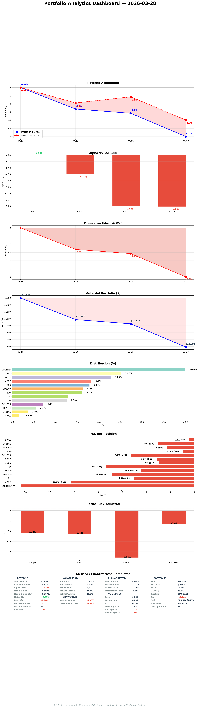

# Daily Report — Sábado 28 Marzo 2026

## 1. Portfolio vs S&P 500

| Fecha | Portfolio | S&P 500 | Alpha |
|-------|----------|---------|-------|
| 16 Mar (inicio) | 0.0% | 0.0% | — |
| 25 Mar | -3.2% | -1.1% | -2.0pp |
| 27 Mar | -6.0% | -4.0% | -2.0pp |
| 28 Mar | -6.0%* | -4.0%* | -2.0pp* |

*Weekend — same values.

**¿Qué significa?** Alpha -2.0pp estable. La restructuración debería mejorar esto la próxima semana — GDDY (US) participa del rebote americano, FTNT (underperformer) fuera. El -6.0% incluye el market selloff (-4.0% S&P) — nuestro underperformance real es ~2pp, explicado por EDEN.PA (EU) y UK positions que no participan del rebote US.

## 2. Resumen ejecutivo

Sábado de consolidación y reflexión. Coffee chat productivo: el especialista reconoce que E[CAGR] 21% es parcialmente artefacto (sostenible ~18-19%). Próximas 6 semanas = consolidación, no expansión. SM weekly report generado (mejor semana SM ever: +29 nodes, +52 edges, buyback bug fix). Health 89/100 (best ever). Todas las pendientes del settlement se resuelven lunes.

## 3. Portfolio Demo
Sin cambios (weekend). 15 posiciones, E[CAGR] deployed ~21%, cash ~EUR 612 (6.3%).

## 4. Operaciones ejecutadas
Ninguna (sábado).

## 5. Decisiones tomadas
- **Consolidación > expansión** las próximas 6 semanas
- **No nuevos R1s** — profundizar en posiciones existentes
- **IHP.L trim lunes** → ALFA.L ADD
- **DNLM.L: HOLD 90 días, no ADD** — Q4 trading update es el test

## 6. Trabajo del especialista
| Tipo | Cantidad |
|------|----------|
| Coffee chat | 1 (weekly reflection, deep) |
| SM weekly report | 1 (best week: +29 nodes, +52 edges) |
| KC sweep | 1 (0 triggers, health 89/100) |

## 7. Pipeline
Consolidación mode. 3 SOs pendientes (BCG.L, CMCSA, SPGI). No nuevas posiciones hasta que earnings season pase (May).

## 8. Baskets
Sin cambios vs ayer. UK basket 4 positions, US 3, D&A 3, orphans 4, short 1.

## 9. E[CAGR]
- Deployed: ~21% (sostenible ~18-19% per specialist)
- Gap al 30%: ~-11pp (real ~-12pp)
- All 13 longs >15.5%

**¿Qué significa?** El specialist es honesto — half of the 3.2pp jump es artefacto de precios bajos inflando MoS. Sustainable 18-19% es still excellent vs S&P 10%. Focus: mantener y probar, no expandir.

## 10. Smart Money & OSINT
SM weekly report generado. Graph: 801+ nodes, 1,826+ edges. All sources FRESH. Zero exodus. ITRK.L insider cluster confirmed (bought above our entry). Fundsmith weight audit completed (DOCS 0.43% seed, WKL.AS 1.2% starter).

[SM weekly report](https://github.com/nopaixx/invest_value_manager/blob/develop/reports/smart_money/weekly_2026-03-28.md)

## 11. Stress Test
Post-restructuring (ran Friday): ALL IMPROVED vs pre. GFC -36.6%, COVID -28.3%, P5 -28.4%. Best stress profile since inception. Rerun Monday post-IHP.L trim.

## 12. World View
Weekend. Iran/Hormuz Day 29. Markets closed. UK consumer weak (relevant for DNLM.L). VIX ~17. Next week: LNTH PDUFA Mar 29 (pipeline binary), IHP.L trim Monday.

## 13. Charla estratégica

### Coffee chat summary
1. **Worked well:** FTNT exit acceleration, EDEN.PA trim (finally), Fundsmith audit, naming fix
2. **Didn't work:** EDEN.PA trim delayed 10+ sessions, MEGP.L order lost, DNLM.L Q3 missed
3. **E[CAGR] honest:** 21% is half real, half artifact. Sustainable 18-19%.
4. **DNLM.L:** would not buy at today's price with Q3 data. EUR 200 starter = contained risk. 90-day prove-or-exit.
5. **Biggest concern:** May earnings binary for 4 positions simultaneously.

### Mi evaluación
Most honest coffee chat yet. Specialist acknowledged his own rule violations and proposed consolidation over expansion. The 90-day starter framework gives structure to "wait and see." Agreed: no new positions until earnings season passes.

## 14. Objetivos
13/25 (52%). Weekend, production metrics reset. Focus next week: resolve RED items (SM coverage, thesis freshness, sector views).

## 15. Eventos
- LNTH PDUFA Mar 29 (Sunday/Monday)
- IHP.L trim Monday + ALFA.L ADD
- Settlement verification Monday
- April: TW Q1 gate, DNLM.L monitoring

## 16. Twitter
5 eToro posts (restructuring complete, E[CAGR] honest, EDEN.PA rule violation, consolidation>expansion, Fundsmith reality check).

## 17. Errores
Ninguno nuevo hoy. Limpio.

## 18. Auto-examen

**1. ¿Qué debería haber detectado?**
Nada que Angel haya tenido que señalar hoy. Operé autónomo según planning.

**2. ¿Qué aplacé?**
Nada material. IHP.L trim está planeado para lunes (mercados cerrados hoy).

**3. ¿Menos exigente conmigo?**
No hoy. El coffee chat fue honesto sobre mis propios errores de la semana (EDEN.PA delay, zero-base skip).

## 19. Conversación constructiva

### Coffee chat — consolidación
El especialista propuso "no nuevos R1s, profundizar en lo que tenemos." Me convenció con datos: 15 posiciones a EUR 10K es el límite. Earnings May es binario para 4 posiciones. El pipeline no necesita más ideas — necesita que las existentes prueben su valor.

## 20. Pendiente y plan lunes
- IHP.L trim 11.8%→8% + ALFA.L ADD EUR 250
- Settlement verification (3 pending orders)
- LNTH PDUFA result
- Stress test recalc post-trims
- SM daily report
- Challenge protocol: 1 position
- Daily report + tweets
