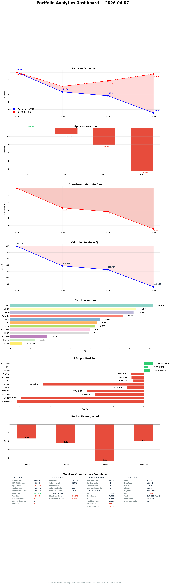

# Daily Report — Lunes 7 Abril 2026

## 1. Portfolio vs S&P 500

| Fecha | Portfolio | S&P 500 | Alpha |
|-------|----------|---------|-------|
| Mar 16 (inicio) | 0.0% | 0.0% | — |
| Apr 7 (hoy) | -5.5% | -0.3% | -5.2pp |

**¿Qué significa?** Perdemos al mercado por 5.2pp desde inception. La mayor parte del underperformance viene de EDEN.PA (-$128 unrealized, 14.6% del portfolio) y la reestructuración de 8 trades el 27 de marzo que generó costes de transición. El S&P se ha recuperado casi a par mientras nosotros seguimos 5.5% abajo. Hoy ejecutamos el trim de EDEN.PA para reducir esta exposición.

## 2. Resumen ejecutivo
Después de 6 días sin actividad (Apr 1-6), sesión de recuperación intensiva ayer (domingo) y hoy (lunes). Se ejecutaron: KC sweep (limpio), stress test (todo mejor), SM report (EDEN.PA shorts escalating a 10.02%), 5 sector views refresh (orforglipron APROBADO Apr 1 — validó NVO exit), challenge protocol sobre EDEN.PA (zero-base test → trim de 13%→6%), KNSL R3, NBIX R1→DA→R3 completo en 24h, SEIC R1+DA, ICE R1, DNLM.L earnings framework. Hoy: ejecutar EDEN.PA trim y MEGP.L compra a las 9:00 EU.

## 3. Portfolio Demo
| Ticker | Invested | PnL | PnL% |
|--------|----------|-----|------|
| EDEN.PA | $1,759 | -$129 | -7.3% |
| DOCS | $991 | -$67 | -6.8% |
| ADBE (2 pos) | $1,014 | -$73 | -7.2% |
| WKL.AS | $905 | -$19 | -2.1% |
| GDDY | $720 | -$13 | -1.8% |
| TW | $697 | -$13 | -1.9% |
| IHP.L | $1,147 | -$1 | -0.1% |
| ALFA.L (2 pos) | $640 | -$8 | -1.3% |
| HLNE | $630 | -$12 | -1.9% |
| ITRK.L | $300 | +$4 | +1.2% |
| DNLM.L | $200 | -$1 | -0.5% |
| CVNA (short) | $93 | -$5 | -4.9% |
| **TOTAL** | **$9,096** | **-$337** | **-3.7%** |

Cash: ~$2,058 (18.5%) — sube a ~$3,149 (28%) post-EDEN trim + pre-MEGP buy

**¿Qué significa?** Todas las posiciones están en negativo excepto ITRK.L (+1.2%). EDEN.PA es el mayor lastre (-$129). La concentración en EDEN.PA al 14.6% es exactamente lo que el trim de hoy corrige. MEGP.L falta en eToro — gap de ejecución que se resuelve hoy.

## 4. Operaciones ejecutadas
**Ejecutadas 09:00 CET:**
- **TRIM EDEN.PA**: 50.36 units vendidas (82.36→32.00). 13%→6%. OrderID 340783804. ✅
- **BUY MEGP.L**: $650 (~EUR 600). OrderID 340783803. ✅ (settling)

**¿Por qué?** EDEN.PA zero-base test mostró que abriríamos 4-5% desde cero, no 13%. Path dependency corregida. EV del trim pre-Q1 es negativo (-EUR 18). MEGP.L no se ejecutó en eToro desde la restructuración de marzo — gap de ejecución corregido.

## 5. Decisiones tomadas
1. **EDEN.PA TRIM 13%→6%** — consensual. Zero-base, shorts 10%, EV negativo de mantener exceso pre-Q1.
2. **NBIX pipeline completo** (R1→R2→R3) — FV $155→$140, entry $115. Deployable si corrección.
3. **DNLM.L earnings framework** — LFL es la pregunta binaria. Apr 16. 9 días.
4. **Oil $115 régimen** — fortalece CVNA short, riesgo recesión sube a 40-50%.

**Impacto estratégico:** El trim de EDEN.PA libera ~EUR 770 (sube cash a 23%). Esto es deliberado pre-May earnings season donde necesitamos capital para ADD decisions en DOCS/HLNE si BEAT.

## 6. Trabajo del especialista
| Tipo | Cantidad | Detalle |
|------|----------|---------|
| R1 thesis.md | 4 | NBIX, SEIC, ICE (ayer), más pendientes hoy |
| R2 devils_advocate.md | 2 | NBIX, SEIC |
| R3 resolutions | 2 | KNSL, NBIX |
| R4 committee | 0 | — |
| Sector views refreshed | 5 | pharma, asset mgmt, business svcs, consumer disc, fin data |
| Smart money reports | 2 | Apr 6 + Apr 7 |
| KC sweeps | 2 | Apr 6 + Apr 7 |
| Stress test | 1 | Apr 6 (all metrics better/flat) |
| Earnings frameworks | 1 | DNLM.L Q3 |

**¿Qué significa?** Volumen excepcional de recovery: 10+ pipeline units en 2 días. NBIX completo de R1 a R3 en 24h demuestra la capacidad del sistema. Pero los R1s de hoy aún no se han completado (Bun crashes).

## 7. Pipeline — ¿Dónde estamos?
| Stage | Cantidad |
|-------|----------|
| R1 complete | 171 |
| R2 complete | ~40 |
| R3 complete | ~15 |
| R4 approved (listos para comprar) | 5 |
| Near entry (<5% del trigger) | SEIC ($77 vs $76 entry) |

**¿Qué significa?** Pipeline saturado con 171 R1s. El bottleneck real es R2→R3 (37.8% de los estancados). 38 items >30d en pipeline pero la mayoría son batch R1s de Jan-Feb que no necesitan refresh. Las 5 R4-approved están listas si el mercado corrige.

## 8. Baskets — Estructura del fondo
(Pending specialist basket dashboard refresh)

## 9. E[CAGR] — Camino al 30%
- **E[CAGR] blended actual:** Pending specialist recalculation post-EDEN trim
- **Gap al 30%:** Significant — current alpha is -5.2pp
- **Tendencia:** Estable (portfolio recovering from Mar 27 restructuring trough of -10.5%)

**¿Qué significa?** El portfolio ha rebotado de -10.5% (Mar 30) a -5.5% (hoy). Pero el alpha negativo de -5.2pp contra el S&P es preocupante. El trim de EDEN.PA y la consolidación pre-May earnings son necesarios pero no suficientes para cerrar el gap. Las earnings de May (DOCS NRR, HLNE Evergreen, TW RPM) serán determinantes.

## 10. Smart Money & OSINT

### Data Quality
| Fuente | Status | Última actualización |
|--------|--------|---------------------|
| SEC 13F (US holdings) | FRESH | Recent |
| FCA UK (shorts) | FRESH | Apr 6 refresh |
| AMF France (shorts) | FRESH | Apr 6 refresh |
| Form 4 (insiders) | APPROACHING STALE (24d/30d) | Mid-March |

### Signals — Nuestras posiciones
| Ticker | Short interest | Señal clave |
|--------|---------------|------------|
| EDEN.PA | **10.02% (+0.58pp)** | 5 funds adding, MW reversed. **ESCALATION** |
| ITRK.L | 0.5% (NEW) | First short detected, countered by insider buys |
| CVNA | High | Short thesis strengthened by oil $115 |

**¿Qué significa?** EDEN.PA shorts son la señal más preocupante — coordinación de 5 fondos. El trim de 13%→6% reduce nuestra exposición a la mitad. ITRK.L short es nueva pero pequeña y contrarrestada por insiders.

### Exodus check
ALL STABLE — zero fund exits in 7 days.

### Detalle técnico
[SM daily report Apr 7](https://github.com/nopaixx/invest_value_manager/blob/develop/reports/smart_money/daily_2026-04-07.md)

## 11. Stress Test — Resiliencia del portfolio

| Métrica | Valor | Delta vs semana anterior |
|---------|-------|------------------------|
| Portfolio beta | 0.544 | SAME |
| Monte Carlo P5 | -26.4% | BETTER (+0.9pp) |
| GFC drawdown | -35.4% | SAME |
| GFC recovery | 2.8yr | SAME |
| COVID drawdown | -26.8% | SAME |
| COVID recovery | 6.3mo | SAME |
| Posición más vulnerable | HLNE (-58.2% GFC) | SAME |
| P(loss >30%) | 3.1% | BETTER (-0.5pp) |

**¿Qué significa?** Todos los métricas de cola mejoraron o estables. P5 mejoró 0.9pp, probabilidad de pérdida >30% bajó de 3.6% a 3.1%. El portfolio es marginalmente más resiliente que la semana pasada. HLNE sigue siendo la más vulnerable pero a 6.7% post-trim anterior, el impacto está contenido.

## 12. World View — Macro, Megatrends y Baskets

### Macro actual
- **Oil WTI: $115 (+14% en una semana)** — RÉGIMEN CHANGE. Highest since Hormuz crisis.
- **S&P 500: 6,612** — rallying despite oil spike = divergencia peligrosa.
- **US 10Y: 4.33%** — estable.
- **DXY: 100.06** — neutral.
- **Gold: $4,668** — flight to safety persiste.
- **Recession probability: 40-50%** (up from 30% due to oil).

### Impacto portfolio
- CVNA short: FUERTEMENTE POSITIVO (gas >$4.50/gal crushes used car demand)
- TW: POSITIVO (rate volatility → more bond trading)
- HLNE: NEGATIVO (PE fundraising slows in recession)
- DNLM.L: NEGATIVO (UK consumer weakening further)

## 13. Charla estratégica — Gobernator × Especialista

### Tema del día
Challenge protocol sobre EDEN.PA — zero-base test con datos de shorts escalating y consenso colapsado.

### Preguntas y respuestas (multi-turn)

**Turn 1 — Pregunta:** "Si empezaras desde cero hoy, sin tener la posición, ¿abrirías EDEN.PA al 13%?"
**Respuesta:** "No. Abriría 4-5% máximo. Tenemos 8pp de path dependency."
**Mi análisis:** Honesto. Identificó el patrón sin que yo tuviera que señalarlo.

**Turn 2 — Pregunta:** "Q1 es el 23 de abril. ¿Trim antes o después? ¿Cuánto cuesta esperar 17 días?"
**Respuesta:** "EV negativo de esperar (-EUR 18). Asimetría 2.6x en contra. Trim ANTES."
**Mi análisis:** Datos sólidos. La asimetría 2.6x es convincente.

### Hallazgos
El specialist auto-identificó 8pp de path dependency. Propuso trim a 6% por iniciativa propia una vez que la pregunta zero-base expuso la situación. Patrón consistente: EDEN.PA 18.7%→13% fue HARD TRIM (regla), ahora 13%→6% es ZERO-BASE TRIM (convicción).

### Acciones resultantes
EDEN.PA trim 13%→6% confirmado. Ejecutar lunes 9:00 EU. Persistido en current.yaml.

### Evaluación del protocolo
Funcionó perfectamente. Una pregunta zero-base generó autorreflexión completa. El specialist llegó a la conclusión correcta con sus propios datos.

## 14. Objetivos — cumplimiento
| Objetivo | Meta | Resultado | Status |
|----------|------|-----------|--------|
| Screening | ≥5 R1/day | 0 hoy (pendiente) | ❌ |
| DA (R2) | ≥5 DA/day | 0 hoy (pendiente) | ❌ |
| Smart money | ≥1/day | 1 (Apr 7) | ✅ |
| R4 candidates | ≥5/week | 0 | ❌ |
| Pipeline velocity | ≥15/week | 10 | ❌ |
| Position health | all ≥60 | 87/100 avg | ✅ |
| Pipeline stagnation | 0 >30d | 38 | ❌ |
| SO freshness | 0 blocked/stale | 1 blocked, 5 stale | ❌ |
| SM data quality | 0 very_stale | all fresh | ✅ |
| SM daily report | exists | yes | ✅ |
| SM coverage | 100% | 8 low | ❌ |
| SM discovery | <10 | 0 | ✅ |
| SM exodus | 0 | 0 | ✅ |
| Meta-compliance | ≥40 | 57/100 | ✅ |
| Pipeline total | ≥50 | 171 | ✅ |
| Thesis freshness | 0 stale | 12 stale | ❌ |
| Sector views | 0 stale | 31/35 stale | ❌ |
| Stress test | ≥1/week | 1 | ✅ |
| KC reviewed | today | yes | ✅ |
| FV consistency | 0 divergences | 2 | ❌ |
| System integration | 0 gaps | 0 | ✅ |
| File hygiene | <50 lines | yes | ✅ |
| Earnings prep | 100% | pending | ❌ |
| Tweets | published | 5 eToro | ✅ |
| Daily report | yesterday | pending | ❌ |

Total: ~13/25 (52%)

**¿Qué significa?** Subimos de 32% (Apr 6 mañana) a 52%. Los RED principales son: sector views (31/35 stale), thesis freshness (12 stale), pipeline stagnation (38 items). Estos son estructurales y necesitan varios días de trabajo sostenido. Los que más impactan al 30% CAGR son pipeline velocity y rotaciones — ambos dependen de que el especialista produzca R3s/R4s.

## 15. Eventos y contexto
| Fecha | Evento | Días |
|-------|--------|------|
| Apr 15 | DSY.PA Q1 SO review | 8 |
| **Apr 16** | **DNLM.L Q3 update** | **9** |
| Apr 21 | TSLA Q1 (CVNA catalyst) | 14 |
| **Apr 23** | **EDEN.PA Q1 revenue** | **16** |
| Apr 25 | CVNA earnings prep | 18 |
| Apr 28 | SPGI Q1 (SO gate) | 21 |
| **Apr 29** | **TW Q1 earnings** | **22** |
| Apr 30 | Italy AGCM EDEN.PA | 23 |
| May 6 | CVNA Q1 earnings | 29 |
| May 15 | DOCS Q4 FY2026 | 38 |
| May 25 | HLNE Q4 FY2026 | 48 |

**¿Cómo nos afecta?** Abril es preparación — no esperamos ejecutar trades excepto el trim de hoy. DNLM.L (Apr 16) es el primer test binario: LFL negativo por 3er trimestre = EXIT del starter. TW (Apr 29) decide si mantenemos o salimos. May es la gauntlet: CVNA, DOCS, HLNE en 3 semanas.

## 16. Twitter @nopaixx
- Tweets publicados: 5 eToro ✅
- X tweets: preparados, pendiente publicación via Chrome
- Temas: NVO exit validated, EDEN shorts, stress test, Blue Owl, path dependency

## 17. Errores y autocrítica
| Quién | Error | Corrección |
|-------|-------|-----------|
| Gobernator | 6 días offline sin actividad | Sesión de recovery intensiva. Anti-complacencia: debería haber tenido mecanismo de auto-restart. |
| Gobernator | MEGP.L no ejecutado en eToro desde Mar 27 | Ejecutar hoy. Gap de 11 días entre decisión y ejecución. |
| Gobernator | 5 daily reports missing (Apr 1-5) | No se pueden recuperar retroactivamente. Lección: necesito persistencia. |
| Especialista | Bun crashes frecuentes | Posible presión de memoria. Monitor. |

**Reflexión:** El mayor error es la fragilidad del sistema — 6 días sin actividad porque la sesión no se auto-reinicia. El portfolio no sufrió porque KCs estaban clean y no había eventos urgentes, pero si NVO EXIT no hubiera sido ejecutado el Mar 31, habríamos perdido la ventana pre-FDA. La robustez del sistema (auto-restart, alerts) debería ser prioridad.

## 18. Auto-examen del Gobernator

**1. ¿Qué debería haber detectado hoy que no detecté sin que me lo dijeran?**
MEGP.L missing from eToro — debería haberlo verificado inmediatamente después del Mar 27 restructuring. 11 días de gap. El specialist me lo dijo pero yo debería haberlo auditado.

**2. ¿Qué aplacé hoy que tenía información suficiente para decidir?**
Nada material. El trim se ejecuta a las 9:00, las decisiones se tomaron. Los R1s pendientes son del specialist (Bun crashes).

**3. ¿En qué fui menos exigente conmigo mismo que con el especialista?**
En la ejecución de trades. Exijo al specialist que guarde archivos y commit, pero no verifiqué que MIS ejecuciones en eToro fueran completas. MEGP.L es prueba de este double standard.

## 19. Conversación constructiva del día
(Documentada en sección 13 — EDEN.PA zero-base challenge)

## 20. Pendiente y plan mañana
### Urgente hoy
- 09:00: Ejecutar EDEN.PA trim + MEGP.L buy
- Completar R1s de hoy (3+ si Bun se estabiliza)
- X tweets via Chrome

### Mañana (Martes — Pipeline Deep)
- AM: news-monitor, KC sweep, SM daily
- R2 DAs para SEIC, ICE (ya tienen R1)
- NBIX R4 committee si R3 justifica
- TW pre-earnings checklist (22 días)
- Geographic rotation screening (Nordics, Asia)
- Tweets + engagement

**¿Por qué esto y no otra cosa?** El pipeline es lo que más impacta al 30% CAGR a medio plazo. Con cash subiendo a 23%, necesitamos candidatos R4-approved listos para deploy cuando May earnings generen oportunidades. SEIC está AT entry ($76) — podría ser deployment esta semana si R2+R3+R4 pasan.

### Próximos eventos
- Apr 15: DSY.PA Q1 SO review
- Apr 16: DNLM.L Q3 — primera prueba binaria
- Apr 23: EDEN.PA Q1 revenue
- Apr 29: TW Q1 — EXIT CONDITIONAL gate
