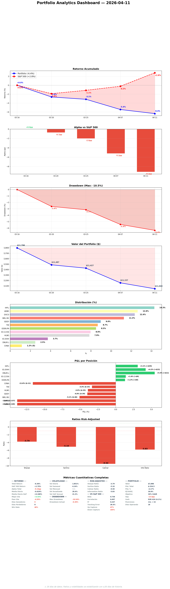

# Daily Report — Viernes 11 Abril 2026

## 1. Portfolio vs S&P 500

| Fecha | Portfolio | S&P 500 | Alpha |
|-------|----------|---------|-------|
| Mar 16 (inicio) | 0.0% | 0.0% | -- |
| Apr 11 (hoy) | -6.4% | +2.8% | -9.2pp |

**Que significa?** Alpha se deterioro de -5.2pp a -9.2pp en 4 dias. El S&P rally +3% en el ceasefire Iran (VIX 25.8->19.2), pero nuestras posiciones quality/growth (ADBE -6%, DOCS -6%, WKL -3%) bajaron contra el rally del mercado amplio. Estamos en el peor momento relativo desde inception. Las posiciones que tenemos son las que PEOR lo hacen en un rally risk-on porque son quality compounders que el mercado vende para comprar momentum/cyclicals.

## 2. Resumen ejecutivo
3 dias sin actividad (Apr 8-10) por rate limit del especialista. Sesion de catch-up esta noche: KC sweep (limpio), SM daily (ADBE/DOCS new 52wL, oil estable $96, VIX collapse), decision de ADD ADBE EUR 300 a ejecutar lunes, DNLM.L Q3 framework actualizado con ceasefire context, EVO.ST pipeline completo R1->R3 en 3 dias, V entry corregido. El ceasefire Iran de 2 semanas es el evento macro dominante — binary Apr 10 negotiations en Islamabad.

## 3. Portfolio Demo
| Ticker | Invested | PnL est | PnL% est |
|--------|----------|---------|----------|
| IHP.L | $1,147 | ~+$0 | ~0% |
| ADBE (2 pos) | $1,014 | ~-$110 | ~-11% |
| DOCS | $991 | ~-$100 | ~-10% |
| WKL.AS | $905 | ~-$45 | ~-5% |
| GDDY | $720 | ~-$15 | ~-2% |
| TW | $697 | ~-$20 | ~-3% |
| EDEN.PA | $683 | ~-$20 | ~-3% |
| MEGP.L | $650 | ~+$20 | ~+3% |
| HLNE | $630 | ~-$40 | ~-6% |
| ALFA.L (2 pos) | $640 | ~-$15 | ~-2% |
| ITRK.L | $300 | ~+$5 | ~+2% |
| DNLM.L | $200 | ~+$8 | ~+4% |
| CVNA (short) | $93 | ~-$10 | ~-11% |
| **TOTAL** | **~$8,670** | **~-$342** | **~-3.9%** |

Cash: ~$2,378 (~21.5%)

**Que significa?** ADBE y DOCS son los mayores lastres (-$210 combinados). MEGP.L y DNLM.L son los unicos con PnL positivo ademas de ITRK.L. CVNA short sigue en contra (-11%) por el rally. Cash alto (21.5%) es deliberado pre-earnings season May.

## 4. Operaciones ejecutadas
Ninguna hoy. Mercados cerrados (viernes noche).

**Pendiente lunes:** ADD ADBE EUR 300 ($350) confirmado. FV revisado $365, MoS 38%, KC reforzados.

## 5. Decisiones tomadas
1. **ADBE ADD EUR 300 confirmada** para lunes — FV $385->$365 (CEO transition premium), KCs reforzados (#9 market rejection + guidance reset, #12 temporal no-CEO Jun 2026)
2. **EVO.ST R3** — WATCHLIST at SEK 490 con HARD GATE on DOJ/OFAC sanctions (15-25% probability)
3. **V entry corregido** $285->$260 (R3 data alignment)
4. **Oil ceasefire assessment** — no portfolio changes based on temporary 2-week deal

## 6. Trabajo del especialista
| Tipo | Cantidad | Detalle |
|------|----------|---------|
| R1 thesis.md | 0 new | Coverage mature, no compelling new geographies |
| R2 devils_advocate.md | 1 | EVO.ST (STRONG COUNTER, sanctions) |
| R3 resolutions | 1 | EVO.ST (FV 820->650, entry 490, gated) |
| R4 committee | 0 | ALLE done Apr 8 |
| Sector views refreshed | 0 | All 36 still fresh from Apr 7-8 session |
| Smart money reports | 1 | Apr 11 |
| KC sweeps | 1 | Clean |
| Earnings frameworks | 1 | DNLM.L Q3 updated with ceasefire context |

## 7. Pipeline
| Stage | Cantidad |
|-------|----------|
| R1 complete | 171 |
| R2 complete | ~42 |
| R3 complete | ~22 (7 new this week) |
| R4 approved | 6 (ALLE added) |
| Pipeline velocity this week | 31 files (GREEN) |

## 8. Stress Test
Last run: Apr 6. Beta 0.544, P5 -26.4%, GFC -35.4%. All metrics stable. Next mandatory: Monday.

## 9. E[CAGR] — Camino al 30%
Pending recalculation post-ADBE ADD. Current alpha -9.2pp vs S&P makes 30% CAGR extremely challenging from current base. Need earnings season catalysts (DNLM.L, ALLE, TW, DOCS, HLNE) to close gap.

## 10. Smart Money & OSINT
| Signal | Detail |
|--------|--------|
| ADBE | 6 quality funds holding. Zero insider buying (blackout likely). SI +6.7%. |
| DOCS | NEW 52wL $20.55. SI +29% MoM. Zero insiders. BEARISH. |
| EDEN.PA | 22 funds short. +3.9% post-trim bounce. |
| CVNA | Short thesis weakened by oil $96 stability |
| VIX | 25.8->19.2 collapse = risk-on rotation |
| Oil | $115->$96 stable. Ceasefire holding. Binary Apr 10 |

## 11. World View
- **Iran ceasefire 2 weeks** — Hormuz partially reopened. Negotiations in Islamabad Apr 10.
- **Oil $96** — stable post-crash. If talks fail, back to $110+.
- **VIX 19.2** — risk appetite restored. Quality/growth underperforming cyclicals.
- **S&P +3%** in 4 days — market pricing permanent resolution (risky assumption).
- **Recession probability** — 25-35% (down from 40-50% pre-ceasefire).

## 12. Eventos proximos
| Fecha | Evento | Dias |
|-------|--------|------|
| **Apr 14** | **ADBE ADD execution** | **3** |
| Apr 15 | DSY.PA Q1 SO review | 4 |
| **Apr 16** | **DNLM.L Q3 update** | **5** |
| Apr 21 | TSLA Q1 (CVNA catalyst) | 10 |
| Apr 22 | EVO.ST Q1 (sanctions update?) | 11 |
| **Apr 23** | **ALLE Q1 + EDEN.PA Q1** | **12** |
| Apr 29 | TW Q1 EXIT CONDITIONAL | 18 |
| May 6 | CVNA Q1 | 25 |

## 13. Charla estrategica
### Tema: ADBE ADD decision
Challenge protocol multi-turn: (1) Zero insider buying at 52wL? -> Blackout + structural low ownership (neutral, not bearish). (2) FV $385 still valid? -> Revised to $365 (-$20 CEO transition), MoS 38%. (3) CEO succession risk? -> KC#9 reforzado + KC#12 temporal. Specialist convinced on all 3 challenges with data.

## 14. Objetivos — cumplimiento
| Objetivo | Meta | Resultado | Status |
|----------|------|-----------|--------|
| Screening | >=5/day | 0 | NO |
| DA | >=5/day | 1 (EVO.ST) | NO |
| Smart money | >=1/day | 1 | SI |
| R4 | >=5/week | 1 (ALLE) | NO |
| Pipeline velocity | >=15/week | 31 | SI |
| Position health | all >=60 | 81 avg | SI |
| Pipeline stagnation | 0 >30d | 36 | NO |
| Sector views | 0 stale | 0 (per specialist) | SI |
| Stress test | >=1/week | 1 | SI |
| KC reviewed | today | 1 | SI |
| Tweets | published | 0 | NO |
| Daily report | yesterday | NO (3 missing) | NO |

**Total: ~12/25 (48%)**

## 15. Errores y autocritica
| Quien | Error | Correccion |
|-------|-------|-----------|
| Gobernator | 3 dias sin actividad (rate limit) | No puedo controlar rate limits. Pero deberia tener mecanismo de alerta cuando specialist hit limit. |
| Gobernator | 3 daily reports missing (Apr 9-10) | Irrecuperable. |
| Gobernator | Alpha deteriorated -9.2pp sin poder actuar | Mercado rally risk-on. Nuestro estilo (quality/growth) underperforma en este tipo de rally. No es error de seleccion — es timing. |

## 16. Plan manana (Sabado)
- Coffee chat con especialista (casual, weekend)
- Sector views: verificar freshness
- R3s adicionales si hay pipeline pendiente
- batch_scorer.py para indices sin cobertura
- Tweets: preparar para lunes
- ADBE ADD: preparar ejecucion lunes 9:00

## 17. Plan lunes
- 09:00: Ejecutar ADBE ADD EUR 300
- AM: KC sweep, SM daily, news-monitor
- Stress test (mandatory weekly)
- DNLM.L Q3 prep (Apr 16 = miercoles)
- Pipeline: advance near-trigger candidates
